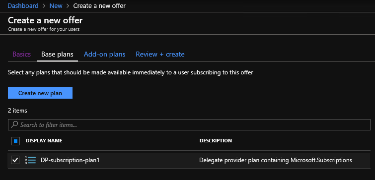
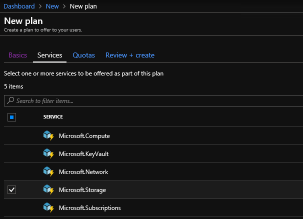
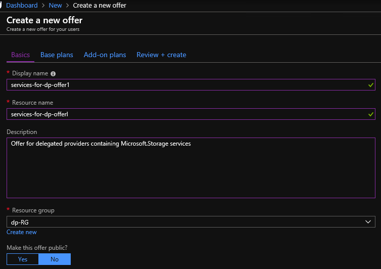
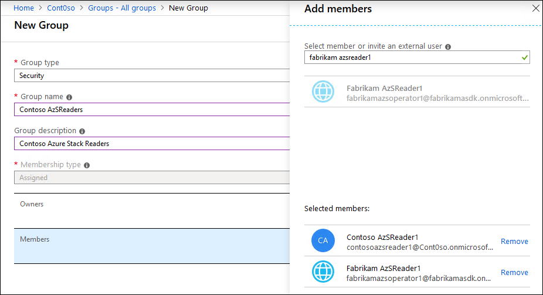
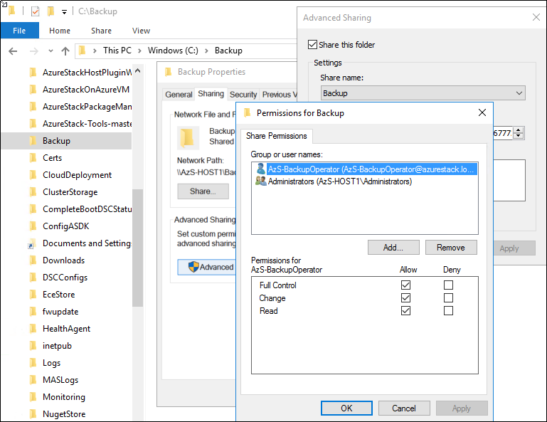



<div class="MCWHeader1">
Azure Stack - Operations
</div>

<div class="MCWHeader2">
Hands-on lab step-by-step
</div>

<div class="MCWHeader3">
October 2019
</div>


Information in this document, including URL and other Internet Web site references, is subject to change without notice. Unless otherwise noted, the example companies, organizations, products, domain names, e-mail addresses, logos, people, places, and events depicted herein are fictitious, and no association with any real company, organization, product, domain name, e-mail address, logo, person, place or event is intended or should be inferred. Complying with all applicable copyright laws is the responsibility of the user. Without limiting the rights under copyright, no part of this document may be reproduced, stored in or introduced into a retrieval system, or transmitted in any form or by any means (electronic, mechanical, photocopying, recording, or otherwise), or for any purpose, without the express written permission of Microsoft Corporation.

Microsoft may have patents, patent applications, trademarks, copyrights, or other intellectual property rights covering subject matter in this document. Except as expressly provided in any written license agreement from Microsoft, the furnishing of this document does not give you any license to these patents, trademarks, copyrights, or other intellectual property.

The names of manufacturers, products, or URLs are provided for informational purposes only and Microsoft makes no representations and warranties, either expressed, implied, or statutory, regarding these manufacturers or the use of the products with any Microsoft technologies. The inclusion of a manufacturer or product does not imply endorsement of Microsoft of the manufacturer or product. Links may be provided to third party sites. Such sites are not under the control of Microsoft and Microsoft is not responsible for the contents of any linked site or any link contained in a linked site, or any changes or updates to such sites. Microsoft is not responsible for webcasting or any other form of transmission received from any linked site. Microsoft is providing these links to you only as a convenience, and the inclusion of any link does not imply endorsement of Microsoft of the site or the products contained therein.

© 2019 Microsoft Corporation. All rights reserved.

Microsoft and the trademarks listed at https://www.microsoft.com/en-us/legal/intellectualproperty/Trademarks/Usage/General.aspx are trademarks of the Microsoft group of companies. All other trademarks are property of their respective owners.

**Contents**

<!-- TOC -->

- [Azure Stack hands-on lab step-by-step](#azure-stack-hands-on-lab-step-by-step)
  - [Abstract and learning objectives](#abstract-and-learning-objectives)
  - [Overview](#overview)
  - [Help references](#help-references)
  - [Requirements](#requirements)
  - [Exercise 1: Create and publish an Azure Stack Marketplace item](#exercise-1-create-and-publish-an-azure-stack-marketplace-item)
    - [Task 1: Set up tools and artifacts for publishing custom Azure Stack Marketplace items](#task-1-set-up-tools-and-artifacts-for-publishing-custom-azure-stack-marketplace-items)
    - [Task 2: Publish a custom Azure Marketplace solution](#task-2-publish-a-custom-azure-marketplace-solution)
  - [Exercise 2: Implement multi-tenancy](#exercise-2-implement-multi-tenancy)
    - [Task 1: Create and configure a new Azure Active Directory tenant](#task-1-create-and-configure-a-new-azure-active-directory-tenant)
    - [Task 2: Configure the existing Azure Stack Azure Active Directory tenant](#task-2-configure-the-existing-azure-stack-azure-active-directory-tenant)
    - [Task 3: Configure the newly created Azure Active Directory tenant](#task-3-configure-the-newly-created-azure-active-directory-tenant)
  - [Exercise 3: Implement delegated management of plans, offers, and subscriptions](#exercise-3-implement-delegated-management-of-plans-offers-and-subscriptions)
    - [Task 1: Create delegated operator and user Azure Active Directory accounts (as the Azure Stack operator)](#task-1-create-delegated-operator-and-user-azure-active-directory-accounts-as-the-azure-stack-operator)
    - [Task 2: Create a plan consisting of the Subscription service (as the Azure Stack operator)](#task-2-create-a-plan-consisting-of-the-subscription-service-as-the-azure-stack-operator)
    - [Task 3: Create an offer based on the plan consisting of the Subscriptions service (as the Azure Stack operator)](#task-3-create-an-offer-based-on-the-plan-consisting-of-the-subscriptions-service-as-the-azure-stack-operator)
    - [Task 4: Create new subscriptions containing the offer with the delegated providers as their subscriber (as the Azure Stack operator)](#task-4-create-new-subscriptions-containing-the-offer-with-the-delegated-providers-as-their-subscriber-as-the-azure-stack-operator)
    - [Task 5: Create a plan to be delegated by delegated providers to users (as the Azure Stack operator)](#task-5-create-a-plan-to-be-delegated-by-delegated-providers-to-users-as-the-azure-stack-operator)
    - [Task 6: Create an offer based on the plan containing Microsoft.Storage (as the Azure Stack operator)](#task-6-create-an-offer-based-on-the-plan-containing-microsoftstorage-as-the-azure-stack-operator)
    - [Task 7: Delegate the offer to delegated providers (as the Azure Stack operator)](#task-7-delegate-the-offer-to-delegated-providers-as-the-azure-stack-operator)
    - [Task 8: Create a delegated provider offer for Contoso users (as the Contoso delegated provider) based on offer from the Azure Stack operator](#task-8-create-a-delegated-provider-offer-for-contoso-users-as-the-contoso-delegated-provider-based-on-offer-from-the-azure-stack-operator)
    - [Task 9: Create a delegated provider offer for Fabrikam users (as the Fabrikam delegated provider) based on offer from the Azure Stack operator](#task-9-create-a-delegated-provider-offer-for-fabrikam-users-as-the-fabrikam-delegated-provider-based-on-offer-from-the-azure-stack-operator)
    - [Task 10: Sign up for the delegated provider's offer (as a Contoso user)](#task-10-sign-up-for-the-delegated-providers-offer-as-a-contoso-user)
    - [Task 11: Sign up for the delegated provider's offer (as a Fabrikam user)](#task-11-sign-up-for-the-delegated-providers-offer-as-a-fabrikam-user)
  - [Exercise 4: Configure Role Based Access Control (RBAC)](#exercise-4-configure-role-based-access-control-rbac)
    - [Task 1: Create a custom role](#task-1-create-a-custom-role)
    - [Task 2: Create Azure AD users and groups](#task-2-create-azure-ad-users-and-groups)
    - [Task 3: Configure RBAC role assignments](#task-3-configure-rbac-role-assignments)
  - [Exercise 5: Connect to and work with the Privileged Endpoint](#exercise-5-connect-to-and-work-with-the-privileged-endpoint)
    - [Task 1: Create a log share](#task-1-create-a-log-share)
    - [Task 2: Connect to the privileged endpoint via PowerShell Remoting](#task-2-connect-to-the-privileged-endpoint-via-powershell-remoting)
    - [Task 3: Review capabilities of the privileged endpoint](#task-3-review-capabilities-of-the-privileged-endpoint)
    - [Task 4: Manage Azure Stack diagnostics log collection via the privileged endpoint.](#task-4-manage-azure-stack-diagnostics-log-collection-via-the-privileged-endpoint)
  - [Exercise 6: Implement Azure Stack infrastructure backup](#exercise-6-implement-azure-stack-infrastructure-backup)
    - [Task 1: Create a backup user](#task-1-create-a-backup-user)
    - [Task 2: Create a backup share](#task-2-create-a-backup-share)
    - [Task 3: Generate an encryption certificate](#task-3-generate-an-encryption-certificate)
    - [Task 4: Configure backup controller](#task-4-configure-backup-controller)
  - [After the hands-on lab](#after-the-hands-on-lab)

<!-- /TOC -->


# Azure Stack hands-on lab step-by-step

## Abstract and learning objectives

In this hands-on lab, you will perform common Azure Stack operational tasks by using the Azure Stack Development Kit. You will start by creating and publishing a custom Azure Marketplace item. Next, you will implement multi-tenant topology by provisioning another Azure Active Directory tenant and adding it to the existing Azure Stack environment. Once that is completed, you will set up delegation by using the delegated provider model and Azure Stack Role-Based Access Control (RBAC). You will conclude this lab by carrying out common Azure Stack operational tasks, including log collection (via Privileged Endpoint) and infrastructure backup (by using the Azure Stack Admin portal).

## Overview

Contoso Finance is one of the largest banks in the United States with a significant amount of their revenue coming from their residential mortgage business. As part of Contoso's shift to a cloud first strategy they planning to migrate their loan web applications to a hybrid cloud solution. 

As the result of a recent acquisition of a financial analytics company named Fabrikam, based in Houston, Texas, Contoso IT management team plans to integrate a number of Fabrikam's internally developed applications to process and analyze the customer data being used by the Contoso's customer facing mortgage application. Fabrikam has skilled development and infrastructure teams, with extensive Azure experience and its own Azure Active Directory tenant. Contoso is very interested in leveraging that experience and plans to offer the Fabrikam IT team sufficient level of autonomy when working on the integration tasks. That autonomy should include the ability of the Fabrikam IT team to offer to their users cloud resources required for application development, implementation, and maintenance. At the same time, Contoso wants to ensure proper governance and facilitate implementation of corporate standards via centralized control of the service catalog content and through automation. 

During the planning stages, Contoso realized they would not be able to retain their customer data in US based Azure regions due to corporate compliance policies and regulatory issues. They have selected Azure Stack as the deployment method to take advantage of Azure technologies while still maintaining compliance.

To help design a solution using Azure technologies, Contoso has engaged a Microsoft Cloud Partner and Service Provider FusionTomo (FT). FT is a full-service hosting provider in North America certified to deliver Azure services with connectivity solutions and partnerships to provide ExpressRoute and other telecom services. They have datacenters located in Denver, London, Las Vegas, Dallas and Hong Kong SAR.

Contoso has expressed to FT the need to embrace Microsoft Azure technologies as well as technologies that will help their organization with a more agile continuous integration and continuous deployment model for application deployment. Contoso also underscored the need for cooperation with Fabrikam's integration teams, including the intent to delegate some of the infrastructure management tasks. 

With these goals in mind, Contoso has challenged FT to help implement the hosted environment must also accommodate requirements regarding integration work to be carried out by Fabrikam. In addition, as internal workloads are transitioned to the hosting environment, Contoso internal audit team must retain its ability to track all of the infrastructure changes. For compliance purposes, the delegation model that will provide Contoso and Fabrikam staff with insight into the hosted environment must comply with the principle of least privilege. To satisfy Contoso governance requirements, FT must document standard operating procedures that will be carried out within the hosted infrastructure. 

## Help references
|    |            |
|----------|:-------------:|
| **Description** | **Links** |
| Azure Stack overview  | <https://azure.microsoft.com/en-us/overview/azure-stack/> |
| Azure Stack use cases | <https://azure.microsoft.com/en-us/overview/azure-stack/use-cases/> |
| Azure Stack features | <https://docs.microsoft.com/en-us/azure/azure-stack/azure-stack-key-features> |
| Azure Stack planning considerations | <https://docs.microsoft.com/en-us/azure/azure-stack/azure-stack-planning-considerations> |
| Azure Stack documentation | <https://docs.microsoft.com/en-us/azure/azure-stack/> |
| Azure Stack Operator documentation | <https://docs.microsoft.com/en-us/azure/azure-stack/> |
| Azure Stack networking | <https://docs.microsoft.com/en-us/azure/azure-stack/user/azure-stack-network-overview/> |
| Deploy apps to Azure and Azure Stack | <https://docs.microsoft.com/en-us/azure/azure-stack/user/azure-stack-solution-pipeline> |
| White paper | <https://azure.microsoft.com/en-us/resources/azure-stack-an-extension-of-azure/> |
| PowerShell for Azure Stack | <https://docs.microsoft.com/en-us/azure/azure-stack/user/azure-stack-powershell-install> |
| Azure Stack marketplace | <https://docs.microsoft.com/en-us/azure/azure-stack/azure-stack-marketplace-azure-items> |


## Requirements

-   Completed all tasks described in **Before the HOL - Azure Stack - Operations**

## Exercise 1: Create and publish an Azure Stack Marketplace item

Duration: 90 minutes

In this exercise, you will create and publish custom Azure Stack Marketplace items by using the Marketplace Toolkit.

   > **Note:** Azure Marketplace Toolkit is part of the Azure Stack Tools 

### Task 1: Set up tools and artifacts for publishing custom Azure Stack Marketplace items

1.  From the AzS-Host1 Azure VM, start Internet Explorer and navigate to http://aka.ms/azurestackmarketplaceitem

2.  When prompted, download the archive file **Azure Stack Marketplace Item Generator and Sample.zip** to the **C:\Downloads** folder (create the folder if needed).

3.  Once the download completes, start File Explorer, select the **View** menu item, and select **File name extensions**.

    

4.  In File Explorer, navigate to the C:\Downloads folder, and extract the compressed content (the **Azure Stack Marketplace Item Generator and Sample** folder) into C:\Downloads.

5.  In File Explorer, navigate to the **C:\Downloads\Azure Stack Marketplace Item Generator and Sample** folder, create a new folder named **ContosoWebAppTemplate** and copy the content of the **SampleVMTemplate** folder into it. 

6.  In File Explorer, navigate to the C:\Downloads\Azure Stack Marketplace Item Generator and Sample\ContosoWebAppTemplate\Icons folder.

7.  right-click the **Wide.png** image, in the right-click menu, and then select **Open with** -> **Paint**.

8.  In the Microsoft Paint window, select **Resize**.

    

9.  In the **Resize and Skew** window, clear the **Maintain aspect ratio** checkbox, select the **Pixels** option, set the following image properties and select **OK**:

    -  Horizontal: **533**

    -  Vertical: **324**

    

10. Save the resulting image as C:\Downloads\Azure Stack Marketplace Item Generator and Sample\ContosoWebAppTemplate\Icons\Screenshot.png (when prompted whether to continue, select **OK**) and close Microsoft Paint. 

    > **Note:** You are using sample images for the sake of simplicity. When creating and publishing custom Azure Stack Marketplace solutions, you would create your own icons and screenshots that represent the characteristics of these solutions. Keep in mind that you must ensure that their sizes match those specified in the documentation available at https://github.com/Azure/portaldocs/blob/master/gallery-sdk/generated/index-gallery.md

11. Delete the file **C:\Downloads\Azure Stack Marketplace Item Generator and Sample\ContosoWebAppTemplate\DeploymentTemplates\azuredeploy-101-simple-windows-vm.json**

12. Start Windows PowerShell ISE as administrator.

13. From the Administrator: Windows PowerShell ISE window, download into the C:\Downloads\Azure Stack Marketplace Item Generator and Sample\ContosoWebAppTemplate\DeploymentTemplates\ folder a sample template that provisions an Azure Stack web app:

     ```
     Invoke-WebRequest `
  		-Uri https://raw.githubusercontent.com/polichtm/MCW-Azure-Stack/master/Hands-on%20lab/resources.operations/ContosoWebAppTempate.json `
		-OutFile 'C:\Downloads\Azure Stack Marketplace Item Generator and Sample\ContosoWebAppTemplate\DeploymentTemplates\ContosoWebAppTempate.json'
     ```

1.  In File Explorer, navigate to the C:\Downloads\Azure Stack Marketplace Item Generator and Sample\ContosoWebAppTemplate\strings folder.

1.  Open the file **resources.resjson** in Notepad, modify its content so it matches the following, save, and close the file:

    ```
    {
      "displayName": "Contoso WebApp",
      "publisherDisplayName": "Contoso",
      "summary": "Deploy a webapp",
      "longSummary": "Deploy a Contoso webapp according to corporate standards",
      "description": "<p>Contoso Azure Stack Marketplace item configured according to corporate standards.</p>",
      "documentationLink": "Documentation"
    }
    ```

1.  In File Explorer, navigate to the C:\Downloads\Azure Stack Marketplace Item Generator and Sample\ContosoWebAppTemplate folder.

1.  Open the file **manifest.json** in Notepad, modify its content so it matches the following, save, and close the file:

    ```
    { "$schema": "https://gallery.azure.com/schemas/2014-09-01/manifest.json#",
        "name": "ContosoWebApp",
        "publisher": "Contoso",
        "version": "1.0.0",
        "displayName": "ms-resource:displayName",
        "publisherDisplayName": "ms-resource:publisherDisplayName",
        "publisherLegalName": "ms-resource:publisherDisplayName",
        "summary": "ms-resource:summary",
        "longSummary": "ms-resource:longSummary",
        "description": "ms-resource:description",
        "longDescription": "ms-resource:description",
        "links": [
            { "displayName": "ms-resource:documentationLink", "uri": "http://go.microsoft.com/fwlink/?LinkId=532898" }
        ], 
        "artifacts": [
            {
                "name": "ContosoWebAppTemplate",
                "type": "Template",
                "path": "DeploymentTemplates\\ContosoWebAppTemplate.json",
                "isDefault": true
            }
        ],
        "icons": {
          "Small": "Icons\\Small.png",
          "Medium": "Icons\\Medium.png",
          "Large": "Icons\\Large.png",
          "Wide": "Icons\\Wide.png"
        },
        "categories":[
    	  "Custom",
    	  "ContosoWebAppTemplate"
        ],
        "uiDefinition": {
          "path": "UIDefinition.json"
        }
    }
    ```

1.  Open the file **UIDefinition** in Notepad, review its content, and close the file without making any modifications:

    ```
    {
        "$schema": "https://gallery.azure.com/schemas/2015-02-12/UIDefinition.json#",
        "createDefinition": {
            "createBlade": {
                "name": "DeployFromTemplateBlade",
                "extension": "HubsExtension"
            }
        }
    }
    ```

    > **Note:** For more information regarding the format and content of the files used for publishing custom Azure Stack Marketplace items, refer to https://github.com/Azure/portaldocs/blob/master/gallery-sdk/generated/index-gallery.md

### Task 2: Publish a custom Azure Marketplace solution

1.  From the Administrator: Windows PowerShell ISE window, generate a Marketplace item package file (Contoso.ContosoWebAppTemplate.1.0.0.azpkg) by running the following:

     ```
     & 'C:\Downloads\Azure Stack Marketplace Item Generator and Sample\AzureGalleryPackageGenerator\AzureGalleryPackager.exe' package -m "C:\Downloads\Azure Stack Marketplace Item Generator and Sample\ContosoWebAppTemplate\manifest.json" -o "C:\Downloads"
     ```
1.  Start Internet Explorer and navigate to the Azure Stack Admin portal at https://adminportal.local.azurestack.external/

1.  When prompted, sign in with the Azure Active Directory credentials you provided when provisioning the Azure Stack environment.

1.  In the Azure Stack Admin portal, in the hub menu, select **+ Create a resource**.

1.  On the New blade, select **Data + Storage** and then select **Storage account - blob, file, table, queue**.

    

1.  On the Create storage account blade, specify the following settings:

    -  Subscription: **Consumption Subscription**

    -  Resource group: the name of a new resource **marketplace-pkgs-RG**

    -  Storage account name: a unique name consisting of between 3 and 24 lower case letters or digits

    -  Location: **local**

    -  Performance: **Standard**

    -  Account kind: **Storage (general purpose v1)**

    -  Replication: **Locally-redundant storage (LRS)**

1.  select **Review + create** and then **Create**. Wait until the storage account is provisioned.

1.  In the hub menu, select **Resource groups**.

1.  On the Resource Groups blade in the list of resource groups, select **marketplace-pkgs-RG**.

1.  On the marketplace-pkgs-RG blade, select the entry representing the newly created storage account.

1.  On the storage account blade, select **Blobs**.

1.  On the Blob service blade, select **+ Container**.

1.  In the Name textbox, type **packages** and in the **Access type** drop down list, select **Blob (anonymous read access for blobs only)**

1.  In the list of containers, select **packages**.

1.  On the packages blade, select **Upload**.

1.  On the upload blob blade, select the folder icon next to the **Select a file** text box. 

1.  In the Choose File to Upload text box, navigate to the location containing the package that you noted in the previous task, select the **Contoso.ContosoWebApp.1.0.0.azpkg** file and select **Open**.

    

1.  Back on the Upload blob blade, select **Upload**.

    > **Note:** Subsequent steps require Azure Stack PowerShell and tools installed. This was performed as part of **Azure Stack Before the Hands-on Lab setup guide**)

1.  From the Administrator: Windows PowerShell ISE window, sign in to the Azure Stack as operator by running the following (make sure to replace the placeholder <tenant_name> with the name of your Azure Active Directory tenant)

    ```powershell
    Set-Location -Path '\AzureStack-Tools-master'

    Add-AzureRMEnvironment -Name "AzureStackAdmin" -ArmEndpoint "https://adminmanagement.local.azurestack.external" `
      -AzureKeyVaultDnsSuffix adminvault.local.azurestack.external `
      -AzureKeyVaultServiceEndpointResourceId https://adminvault.local.azurestack.external

    $AuthEndpoint = (Get-AzureRmEnvironment -Name "AzureStackAdmin").ActiveDirectoryAuthority.TrimEnd('/')
    $AADTenantName = "<tenant_name>.onmicrosoft.com"
    $TenantId = (Invoke-RestMethod "$($AuthEndpoint)/$($AADTenantName)/.well-known/openid-configuration").issuer.TrimEnd('/').Split('/')[-1]

    Add-AzureRmAccount -EnvironmentName "AzureStackAdmin" -TenantId $TenantId

    ```
1.  When prompted, sign in with your Azure Active Directory account that you provided when provisioning the Azure Stack environment.

1.  From the Administrator: Windows PowerShell ISE window, publish the package to Azure Stack Marketplace by running the following (make sure to replace the placeholder <storageaccountname> with the name of the storage account you created earlier in this task):

    ```
    Add-AzsGalleryItem -GalleryItemUri `
      https://<storageaccountname>.blob.local.azurestack.external/packages/Contoso.ContosoWebApp.1.0.0.azpkg -Verbose
    ```

1.  Ensure that the command completes successfully.

1.  Switch back to the Azure Stack Admin portal, in the hub menu, select **+ Create a resource**.

    > **Note:** Alternatively, you can use the Azure Stack User portal at <https://portal.local.azurestack.external/>. The newly added Marketplace item should be available in both.

1.  On the New blade, select **Custom**.

1.  On the Custom blade, select **See all** and ensure that **Contoso WebApp** appears in the list of resource types to provision.

    > **Note:** It might take a few minutes for a newly added Marketplace item to appear

    

1.  On the Custom blade, select **Contoso WebApp**.

1.  On the Contoso webapp blade, review the interface of the Contoso webapp blade to verify that it reflects the configuration you specified when creating the package.

1.  On the Contoso webapp blade, select **Create**

1.  Step through the process of configuring the deployment but do not select **Create**.

1.  Close all open windows.

    > **Note:** In general, in order to ensure that the new Azure Stack Marketplace item is functional, you also need to satisfy all of the prerequisites for its deployment, such as OS images referenced by a VM template, are in place. 


## Exercise 2: Implement multi-tenancy

Duration: 30 minutes

In this exercise, you will implement Azure Stack multi-tenancy.

### Task 1: Create and configure a new Azure Active Directory tenant

1.  From the AzS-Host1 Azure VM, start a web browser, navigate to the Azure portal at <https://portal.azure.com>, and sign in by using an account with the Global Admin privileges to the Azure AD tenant associated with the Azure Stack environment.

1.  In the Azure portal, select **+ Create a resource**.

1.  On the New blade, in the **Search the Marketplace** text box, type **Azure Active Directory** and, in the list of results, select **Azure Active Directory**.

1.  On the Azure Active Directory blade, select **Create**. 

1.  On the Create directory blade, specify the following settings and select **Create**:

    -  Organization name: **Fabrikam**

    -  Initial domain name: any valid, unique domain portion of the fully qualified DNS domain name in the onmicrosoft.com namespace.

    -  Country or region: **United States**

1.  Wait until the new directory is created and then use the link **select here to manage your new directory** to navigate to the **Fabrikam** Azure Active Directory blade.

1.  On the Fabrikam - Overview blade, select **Users**.

1.  On the Users - All users blade, select **+ New user**

1.  On the **New user** blade, ensure that the **Create user** option is selected, specify the following settings, note the values of the full user name (including the domain suffix) and the randomly generated password, and select **Create**:

    > **Note:** Take a note of the user names (including the domain suffix) and their autogenerated passwords. You will need them in the subsequent tasks of this lab.

    -  User name: **fabrikamadmin1**

    -  Name: **Fabrikam Admin1**

    -  First name: not set

    -  Last name: not set

    -  Password: **Auto-generate password**

    -  Initial password: **Show Password**

    -  Roles: **Global administrator**

    -  Block sign in: **No**

    -  Usage location: **United States**

    -  Job title : not set

    -  Department : not set

1.  Back on the Users - All users blade, select **+ New user**

1.  On the **New user** blade, ensure that the **Create user** option is selected, specify the following settings, note the values of the full user name (including the domain suffix) and the randomly generated password, and select **Create**:

    -  User name: **fabrikamuser1**

    -  Name: **Fabrikam User1**

    -  First name: not set

    -  Last name: not set

    -  Password: **Auto-generate password**

    -  Initial password: **Show Password**

    -  Roles: **User**

    -  Block sign in: **No**

    -  Usage location: **United States**

    -  Job title : not set

    -  Department : not set

1.  select the **Directory + Subscription** icon (to the right of the Cloud Shell icon). 

1.  In the Directory + Subscription pane, in the Switch directory section, select the entry representing the Azure Active Directory tenant associated with the Azure Stack environment.

1.  In the Azure portal, select the user name appearing in the upper right corner, select **Sign out**, and then close the web browser window.

### Task 2: Configure the existing Azure Stack Azure Active Directory tenant

1.  Start Windows PowerShell ISE as administrator.

    > **Note:** Subsequent steps require Azure Stack PowerShell and tools installed. This was performed as part of **Azure Stack - Operations - Before the hands-on lab setup guide**

1.  From the Administrator: Windows PowerShell ISE window, set the current directory to the location of the Azure Stack Tools and import required PowerShell modules by running the following:

    ```powershell
    Set-Location -Path '\AzureStack-Tools-master'
    Import-Module .\Connect\AzureStack.Connect.psm1
    Import-Module .\Identity\AzureStack.Identity.psm1
    ```

1.  From the Administrator: Windows PowerShell ISE window, sign in to the Azure Stack as operator by running the following (make sure to replace the placeholder <tenant_name> with the name of your Azure Active Directory tenant)

    ```powershell
    Add-AzureRMEnvironment -Name "AzureStackAdmin" -ArmEndpoint "https://adminmanagement.local.azurestack.external" `
      -AzureKeyVaultDnsSuffix adminvault.local.azurestack.external `
      -AzureKeyVaultServiceEndpointResourceId https://adminvault.local.azurestack.external

    $AuthEndpoint = (Get-AzureRmEnvironment -Name "AzureStackAdmin").ActiveDirectoryAuthority.TrimEnd('/')
    $AADTenantName = "<tenant_name>.onmicrosoft.com"
    $TenantId = (Invoke-RestMethod "$($AuthEndpoint)/$($AADTenantName)/.well-known/openid-configuration").issuer.TrimEnd('/').Split('/')[-1]

    Add-AzureRmAccount -EnvironmentName "AzureStackAdmin" -TenantId $TenantId
    ```
1.  When prompted, sign in with your Azure Active Directory account that you provided when provisioning the Azure Stack environment.

1.  From the Administrator: Windows PowerShell ISE window, specify that you will accept identities from the newly created Azure Active Directory tenant by running the following (replace the placeholder `<contoso>` with the DNS name of the existing Azure AD tenant and the placeholder `<fabrikam>` with the DNS name of the newly created Azure AD tenant):

     ```
     $adminARMEndpoint = "https://adminmanagement.local.azurestack.external"

     $azureStackDirectoryTenant = "<contoso>.onmicrosoft.com"
     $guestDirectoryTenantToBeOnboarded = "<fabrikam>.onmicrosoft.com"
     $ResourceGroupName = "system.local"
     $location = "local"
     $SubscriptionName = "Default Provider Subscription"

     Register-AzSGuestDirectoryTenant -AdminResourceManagerEndpoint $adminARMEndpoint `
      -DirectoryTenantName $azureStackDirectoryTenant `
      -GuestDirectoryTenantName $guestDirectoryTenantToBeOnboarded `
      -Location $location `
      -ResourceGroupName $ResourceGroupName `
      -SubscriptionName $SubscriptionName
     ```

1.  When prompted, sign in with your Azure Active Directory account that you provided when provisioning the Azure Stack environment.

1.  Verify that the operation was successful and close the Administrator: Windows PowerShell ISE window.

### Task 3: Configure the newly created Azure Active Directory tenant

1.  Start Windows PowerShell ISE as administrator.

1.  From the Administrator: Windows PowerShell ISE window, set the current directory to the location of the Azure Stack Tools and import required PowerShell modules by running the following:

    ```powershell
    Set-Location -Path '\AzureStack-Tools-master'
    Import-Module .\Connect\AzureStack.Connect.psm1
    Import-Module .\Identity\AzureStack.Identity.psm1
    ```

1.  From the Administrator: Windows PowerShell ISE window, register Azure Stack with the newly created Azure Active Directory tenant by running the following (replace the placeholder `<fabrikam>` with the DNS name of the newly created Azure AD tenant):

     ```
     $tenantARMEndpoint = "https://management.local.azurestack.external"
     $guestDirectoryTenantName = "<fabrikam>.onmicrosoft.com"

     Register-AzSWithMyDirectoryTenant `
      -TenantResourceManagerEndpoint $tenantARMEndpoint `
      -DirectoryTenantName $guestDirectoryTenantName `
      -Verbose
     ```

1.  When prompted, sign in by using the **FabrikamAdmin1** account you created in the first task of this exercise. In the Update your password window, change the password to **demo@pass123**.

1.  Verify that the operation was successful and close the Administrator: Windows PowerShell ISE window.

1.  To verify that the multi-tenancy has been configured properly, start Internet Explorer with the InPrivate Browsing option, navigate to the Azure Stack user portal at <https://portal.local.azurestack.external/> and, when prompted, authenticate by using the **FabrikamUser1** account you created in the first task of this exercise.

    > **Note:** Multi-tenancy provides the ability for users in the guest Azure Active Directory tenant to access the Azure Stack user portal (and their respective subscriptions), but not the Azure Stack Admin portal.

1.  Close all open windows.


## Exercise 3: Implement delegated management of plans, offers, and subscriptions

Duration: 90 minutes

In this exercise, you will implement Azure Stack delegation in a multi-tenant environment

   > **Note:** Implementing delegation in a single tenant environment follows the same procedure as the one described in this exercise. The only difference is that you delegate to identities (users and groups) which reside exclusively in the same Azure Active Directory tenant. 

### Task 1: Create delegated operator and user Azure Active Directory accounts (as the Azure Stack operator)

1.  From the AzS-Host1 Azure VM, start a web browser, navigate to the Azure portal at <https://portal.azure.com>, and sign in with the Azure Active Directory credentials you provided when provisioning the Azure Stack environment.

1.  In the Azure portal, select **Azure Active Directory**.

1.  On the Azure Active Directory blade of the tenant associated with the Azure Stack environment, select **Users**.

1.  On the Users - All users blade, select **+ New user**

1.  On the **New user** blade, ensure that the **Create user** option is selected, specify the following settings, note the values of the full user name (including the domain suffix) and the randomly generated password, and select **Create**:

    > **Note:** Take a note of the user names (including the domain suffix) and their autogenerated passwords. You will need them in the subsequent tasks of this lab.

    -  User name: **contosoazsdp1**

    -  Name: **Contoso AzSDP1**

    -  First name: not set

    -  Last name: not set

    -  Password: **Auto-generate password**

    -  Initial password: **Show Password**

    -  Roles: **User**

    -  Block sign in: **No**

    -  Usage location: **United States**

    -  Job title : not set

    -  Department : not set

1.  Back on the Users - All users blade, select **+ New user**

1.  On the **New user** blade, ensure that the **Create user** option is selected, specify the following settings, note the values of the full user name (including the domain suffix) and the randomly generated password, and select **Create**:

    -  User name: **contosouser1**

    -  Name: **Contoso User1**

    -  First name: not set

    -  Last name: not set

    -  Password: **Auto-generate password**

    -  Initial password: **Show Password**

    -  Roles: **User**

    -  Block sign in: **No**

    -  Usage location: **United States**

    -  Job title : not set

    -  Department : not set

1.  Leave the browser window open.

1.  Start a web browser using in private/incognito mode, navigate to the Azure portal at <https://portal.azure.com>, and sign in with the **FabrikamAdmin1** Azure Active Directory credentials you created in the previous exercise. 

1.  In the Azure portal, select **Azure Active Directory**.

1.  On the Azure Active Directory blade of the Fabrikam Azure Active Directory tenant select **Users**.

1.  On the Users - All users blade, select **+ New user**

1.  On the **New user** blade, ensure that the **Create user** option is selected, specify the following settings, note the values of the full user name (including the domain suffix) and the randomly generated password, and select **Create**:

    -  User name: **fabrikamazsdp1**

    -  Name: **Fabrikam AzSDP1**

    -  First name: not set

    -  Last name: not set

    -  Password: **Auto-generate password**

    -  Initial password: **Show Password**

    -  Roles: **User**

    -  Block sign in: **No**

    -  Usage location: **United States**

    -  Job title : not set

    -  Department : not set

1.  Leave the browser in private/incognito mode window open.

### Task 2: Create a plan consisting of the Subscription service (as the Azure Stack operator)

1.  Start Internet Explorer and navigate to the Azure Stack Admin portal at https://adminportal.local.azurestack.external/

1.  When prompted, sign in with the Azure Active Directory credentials you provided when provisioning the Azure Stack environment.

1.  In the Azure Stack Admin portal, select **+ Create a resource**. 

1.  On the New blade, select **Offers + Plans** and then select **Plan**.

1.  On the Basics tab of the New plan blade, specify the following settings:

    -  Display name: **DP-subscription-plan1**

    -  Resource name: **dp-subscription-plan1**

    -  Description: **Delegated provider plan containing Microsoft.Subscriptions**

    -  Resource group: name of a new resource group **dp-RG**

    

1.  select the **Services** tab.

1.  On the Services tab of the New plan blade, select the **Microsoft.Subscriptions** checkbox.

    

1.  select **Quotas**.

1.  On the Quotas tab of the New plan blade, in the **Microsoft.Subscriptions** drop down list, select **delegatedProviderQuota**.

    

1.  select **Review + create** and then select **Create**. 

### Task 3: Create an offer based on the plan consisting of the Subscriptions service (as the Azure Stack operator)

1.  In the Azure Stack Admin portal, select **+ Create a resource**. 

1.  On the New blade, select **Offers + Plans** and then select **Offer**.

1.  On the Basics tab of the Create a new offer blade, specify the following settings:

    -  Display name: **Subscription-for-dp-offer1**

    -  Resource name: **subscription-for-dp-offer1**

    -  Description: **Offer for delegated providers containing Microsoft.Subscriptions services**

    -  Resource group: **dp-RG**

    -  Make this offer public?: **No**

    

1.  select the **Base plans** tab.

1.  On the **Base plans** tab of the Create a new offer blade, select the **DP-subscription-plan1** checkbox.

    

1.  Do not include Add-on plans, select **Review + create**, and then select **Create**. 

### Task 4: Create new subscriptions containing the offer with the delegated providers as their subscriber (as the Azure Stack operator)

1.  In the Azure Stack Admin portal, select **+ Create a resource**. 

1.  On the New blade, select **Offers + Plans** and then select **Subscription**.

1.  On the New user subscription blade, specify the following settings:

    -  Display name: **Contoso-DP-subscription1**

    -  User: UPN of the **Contoso AzSDP1** user you created earlier in this exercise

    -  Offer: **Subscription-for-dp-offer1**

    -  Directory tenant: the Azure Active Directory tenant associated with the Azure Stack environment

    

1.  select **Create**. 

1.  In the Azure Stack Admin portal, select **+ Create a resource**. 

1.  On the New blade, select **Offers + Plans** and then select **Subscription**.

1.  On the New user subscription blade, specify the following settings:

    -  Display name: **Fabrikam-DP-subscription1**

    -  User: UPN of the **Fabrikam AzSDP1** user you created earlier in this exercise

    -  Offer: **Subscription-for-dp-offer1**

    -  Directory tenant: the Fabrikam Azure Active Directory tenant which you associated with the Azure Stack environment in the previous exercise.

    

1.  select **Create**. 

### Task 5: Create a plan to be delegated by delegated providers to users (as the Azure Stack operator)

1.  In the Azure Stack Admin portal, select **+ Create a resource**. 

1.  On the New blade, select **Offers + Plans** and then select **Plan**.

1.  On the Basics tab of the New plan blade, specify the following settings:

    -  Display name: **DP-services-plan1**

    -  Resource name: **dp-services1-plan**

    -  Description: **Delegated provider plan containing services to be delegated to users**

    -  Resource group: **dp-RG**

    

1.  select the **Services** tab.

1.  On the Services tab of the New plan blade, select the **Microsoft.Storage** checkbox.

    

1.  select the **Quotas** tab.

1.  On the Quotas blade, select **Create new** next to the **Microsoft Storage** drop-down list.

1.  On the Create Storage quota blade, specify the following settings:

    -  Name: **dp-storage-quota1**

    -  Maximum capacity (GB): **200**

    -  Total number of storage accounts: **1**

    

1.  select **OK**. This will automatically set the **Microsoft Storage** drop-down list entry to **dp-storage-quota1**.

1.  select **Review + create** and then select **Create**. 

### Task 6: Create an offer based on the plan containing Microsoft.Storage (as the Azure Stack operator)

1.  In the Azure Stack Admin portal, select **+ Create a resource**. 

1.  On the New blade, select **Offers + Plans** and then select **Offer**.

1.  On the Basics tab of the Create new offer blade, specify the following settings:

    -  Display name: **services-for-dp-offer1**

    -  Resource name: **cotodp-services1-offer**

    -  Description: **Offer for delegated providers containing Microsoft.Storage services**

    -  Resource group: **dp-RG**

    -  Make this offer public?: **No**

    

1.  select the **Base plans** tab.

1.  On the Base plans tab of the Create a new offer blade, select the **DP-services-plan1** checkbox.

    

1.  Do not include Add-on plans, select **Review + create**, and then select **Create**. 

### Task 7: Delegate the offer to delegated providers (as the Azure Stack operator)

1.  In the Azure Stack Admin portal, select **All services** and then select **Offers**. 

1.  On the Offers blade, select **services-for-dp-offer1**.

1.  On the services-for-dp-offer1 blade, select **Delegated providers**.

1.  select **+ Add**.

1.  On the Delegate offer blade, specify the following settings:

    -  Name: accept the default name

    -  Pick the delegated provider subscription: **Contoso-DP-subscription1**

    

1.  select **Delegate**. 

1.  In the Azure Stack Admin portal, select **All services** and then select **Offers**. 

1.  On the Offers blade, select **services-for-dp-offer1**.

1.  On the services-for-dp-offer1 blade, select **Delegated providers**.

1.  select **+ Add**.

1.  On the Delegate offer blade, specify the following settings:

    -  Name: accept the default name

    -  Pick the delegated provider subscription: **Fabrikam-DP-subscription1**

    

1.  select **Delegate**. 

### Task 8: Create a delegated provider offer for Contoso users (as the Contoso delegated provider) based on offer from the Azure Stack operator

   > **Note:** This will allow Contoso users to create subscriptions based on the offer from the delegated provider

1.  Start a web browser with the InPrivate Browsing option, navigate to the Azure Stack user portal at <https://portal.local.azurestack.external/> and, when prompted, authenticate by using the **Contoso AzSDP1** account you created in the first task of this exercise. In the Update your password window, change the password to **demo@pass123**.

1.  In the Azure Stack user portal, select **All services** and then select **Offers**. 

1.  On the Create a new offer blade, select **Delegated offer**.

1.  On the Delegated offer blade, select the entry corresponding to the delegated offer based on **services-for-dp-offer1**.

1.  On the Create a new offer blade, specify the following settings:

    -  Display name: the name matching the **Delegated offer** entry.

    -  Resource name: the name matching the **Delegated offer** entry.

    -  Provider subscription: **Contoso-DP-subscription1**

    -  Resource group: the name of a new resource group **Contoso-dp1-RG**

    

1.  select **Create**. 

1.  Back on the **Offers** blade, select the newly created offer.

    > **Note:** You might need to select **Refresh**

1.  On the blade of the newly created offer, select **Change state** and, in the drop-down list, select **Public**.

    

1.  In the Azure Stack user portal, select **All services**. 

1.  In the list of services, select **Subscriptions**.

1.  On the Subscriptions blade, select **Contoso-DP-subscription1**.

1.  On the Contoso-DP-subscription1 blade, select **Properties**.

1.  On the properties blade, copy the value of the PORTAL URL to clipboard. You will need it in the next task of this exercise, 

    > **Note:** Tenants need to subscribe to the offer from that URL

1.  Sign out from the Azure Stack tenant portal and close the web browser window.

### Task 9: Create a delegated provider offer for Fabrikam users (as the Fabrikam delegated provider) based on offer from the Azure Stack operator

   > **Note:** This will allow Fabrikam users to create subscriptions based on the offer from the delegated provider

1.  Start a web browser with the InPrivate Browsing option, navigate to the Azure Stack user portal at <https://portal.local.azurestack.external/> and, when prompted, authenticate by using the **Fabrikam AzSDP1** account you created in the first task of this exercise. In the Update your password window, change the password to **demo@pass123**.

1.  In the Azure Stack user portal, select **All services** and then select **Offers**. 

1.  On the Offers blade, select **+ Add**

1.  On the Create a new offer blade, select **Delegated offer**.

1.  On the Delegated offer blade, select the entry corresponding to the delegated offer based on **services-for-dp-offer1**.

1.  On the Create a new offer blade, specify the following settings:

    -  Display name: the name matching the **Delegated offer** entry.

    -  Resource name: the name matching the **Delegated offer** entry.

    -  Provider subscription: **Fabrikam-DP-subscription1**

    -  Resource group: the name of a new resource group **Fabrikam-dp1-RG**

    

1.  select **Create**. 

1.  Back on the **Offers** blade, select the newly created offer.

    > **Note:** You might need to select **Refresh**

1.  On the blade of the newly created offer, select **Change state** and, in the drop-down list, select **Public**.

    

1.  In the Azure Stack user portal, select **All services**. 

1.  In the list of services, select **Subscriptions**.

1.  On the Subscriptions blade, select **Fabrikam-DP-subscription1**.

1.  On the Fabrikam-DP-subscription1 blade, select **Properties**.

1.  On the properties blade, copy the value of the PORTAL URL to clipboard. You will need it in the next task of this exercise, 

    > **Note:** Tenants need to subscribe to the offer from that URL

1.  Sign out from the Azure Stack tenant portal and close the web browser window.

### Task 10: Sign up for the delegated provider's offer (as a Contoso user)

1.  Start a web browser with the InPrivate Browsing option, navigate to the Contoso delegated provider portal URL you identified earlier in this exercise, and, when prompted, authenticate by using the **Contoso User1** account you created in the first task of this exercise. In the Update your password window, change the password to **demo@pass123**.

    > **Note:** Make sure NOT to use the Azure Stack user portal URL in this case

1.  In the Azure Stack user portal, select **Get a subscription** on the dashboard. 

1.  On the Get a subscription blade, in the Display name text box, type **Contoso-user1-subscription1**

1.  select **Select an offer**.

1.  On the Choose an offer blade, select the name of the Contoso delegated offer created earlier in this exercise.

1.  select **Create**.

1.  In the message box **Your subscription has been created. You must refresh the portal to start using your subscription**, select **Refresh**. 

### Task 11: Sign up for the delegated provider's offer (as a Fabrikam user)

1.  Start a web browser with the InPrivate Browsing option, navigate to the Fabrikam delegated provider portal URL you identified earlier in this exercise, and, when prompted, authenticate by using the **Fabrikam User1** account you created in the first task of this exercise. In the Update your password window, change the password to **demo@pass123**.

    > **Note:** Make sure NOT to use the Azure Stack user portal URL in this case

1.  In the Azure Stack user portal, select **Get a subscription** on the dashboard. 

1.  On the Get a subscription blade, in the Display name text box, type **Fabrikam-user1-subscription1**

1.  select **Select an offer**.

1.  On the Choose an offer blade, select the name of the Contoso delegated offer created earlier in this exercise.

1.  select **Create**.

1.  In the message box **Your subscription has been created. You must refresh the portal to start using your subscription**, select **Refresh**. 


## Exercise 4: Configure Role Based Access Control (RBAC)

Duration: 30 minutes

In this exercise, you will configure Role Based Access Control using a custom role

### Task 1: Create a custom role

1.  From the AzS-Host1 Azure VM, start Windows PowerShell ISE as administrator.

1.  From the Administrator: Windows PowerShell ISE window, sign in to the Azure Stack as operator by running the following (make sure to replace the placeholder <tenant_name> with the name of your Azure Active Directory tenant)

    ```powershell
    Set-Location -Path '\AzureStack-Tools-master'

    Add-AzureRMEnvironment -Name "AzureStackAdmin" -ArmEndpoint "https://adminmanagement.local.azurestack.external" `
      -AzureKeyVaultDnsSuffix adminvault.local.azurestack.external `
      -AzureKeyVaultServiceEndpointResourceId https://adminvault.local.azurestack.external

    $AuthEndpoint = (Get-AzureRmEnvironment -Name "AzureStackAdmin").ActiveDirectoryAuthority.TrimEnd('/')
    $AADTenantName = "<tenant_name>.onmicrosoft.com"
    $TenantId = (Invoke-RestMethod "$($AuthEndpoint)/$($AADTenantName)/.well-known/openid-configuration").issuer.TrimEnd('/').Split('/')[-1]

    Add-AzureRmAccount -EnvironmentName "AzureStackAdmin" -TenantId $TenantId

    ```
1.  When prompted, sign in with your Azure Active Directory account that you provided when provisioning the Azure Stack environment.

1.  From the Administrator: Windows PowerShell ISE window, sign in to the Azure Stack as operator by running the following

    ```powershell
    $defaultProviderSubscriptionId = (Get-AzureRmSubscription -SubscriptionName 'Default Provider Subscription').Id
    Set-AzureRmContext -SubscriptionId $defaultProviderSubscriptionId
    $defaultProviderSubscriptionId 
    ```

1.  Copy the value of the Default Provider Subscription ID displayed in the Administrator: Windows PowerShell ISE window into Clipboard.

1.  Start File Explorer, create a file **C:\Downloads\CustomReaderRoleDefinition.json** (create the folder **C:\Downloads** if needed), add the following content to it, replace the placeholder `<default_provider_subscription_id>` with the value you copied into Clipboard, and save the file: 

     ```
     {
         "Name":"Activity Log Reader (custom)",
         "IsCustom":true,
         "Description":"Grants permissions to read Activity Log",
         "Actions": [
                 "Microsoft.Insights/eventtypes/*"
         ],
         "NotActions":[
         ],
         "AssignableScopes":[
                 "/subscriptions/<default_provider_subscription_id>"
         ]
     }
     ```

1.  From the Administrator: Windows PowerShell ISE window, create a custom role definition by running:

     ```
     New-AzureRmRoleDefinition -InputFile "C:\Downloads\CustomReaderRoleDefinition.json"
     ```

### Task 2: Create Azure AD users and groups

1.  From the AzS-Host1 Azure VM, start a web browser using in private/incognito mode, navigate to the Azure portal at <https://portal.azure.com>, and sign in with the **FabrikamAdmin1** Azure Active Directory credentials you created earlier in this lab. 

1.  In the Azure portal, select **Azure Active Directory**.

1.  On the Azure Active Directory blade of the Fabrikam Azure Active Directory tenant, select **Users**.

1.  On the Users - All users blade, select **+ New user**

1.  On the **New user** blade, ensure that the **Create user** option is selected, specify the following settings, note the values of the full user name (including the domain suffix) and the randomly generated password, and select **Create**:

    > **Note:** Take a note of the user names (including the domain suffix) and their autogenerated passwords. You will need them in the subsequent tasks of this lab.

    -  User name: **fabrikamazsreader1**

    -  Name: **Fabrikam AzSReader1**

    -  First name: not set

    -  Last name: not set

    -  Password: **Auto-generate password**

    -  Initial password: **Show Password**

    -  Roles: **User**

    -  Block sign in: **No**

    -  Usage location: **United States**

    -  Job title : not set

    -  Department : not set

1.  Sign out as FabrikamAdmin1 from the Azure portal and close the window of the web browser using in private/incognito mode.

1.  From the AzS-Host1 Azure VM, start a web browser, navigate to the Azure portal at <https://portal.azure.com>, and sign in with the Azure Active Directory credentials you provided when provisioning the Azure Stack environment.

1.  In the Azure portal, select **Azure Active Directory**.

1.  On the Azure Active Directory blade of the tenant associated with the Azure Stack environment, select **Users**.

1.  On the Users - All users blade, select **+ New user**

1.  On the **New user** blade, ensure that the **Create user** option is selected, specify the following settings, note the values of the full user name (including the domain suffix) and the randomly generated password, and select **Create**:

    > **Note:** Take a note of the user names (including the domain suffix) and their autogenerated passwords. You will need them in the subsequent tasks of this exercise.

    -  User name: **contosoazsreader1**

    -  Name: **Contoso AzSReader1**

    -  First name: not set

    -  Last name: not set

    -  Password: **Auto-generate password**

    -  Initial password: **Show Password**

    -  Roles: **User**

    -  Block sign in: **No**

    -  Usage location: **United States**

    -  Job title : not set

    -  Department : not set

1.  Back on the Users - All users blade, select **+ New user**

1.  On the **New user** blade, ensure that the **Create user** option is selected, specify the following settings, note the values of the full user name (including the domain suffix) and the randomly generated password, and select **Create**:

    -  User name: **contosoazslogreader1**

    -  Name: **Contoso AzSLogReader1**

    -  First name: not set

    -  Last name: not set

    -  Password: **Auto-generate password**

    -  Initial password: **Show Password**

    -  Roles: **User**

    -  Block sign in: **No**

    -  Usage location: **United States**

    -  Job title : not set

    -  Department : not set

1.  Back on the Users - All users blade, select **+ New guest user**

1.  On the **New user** blade, ensure that the **Invite user** option is selected, specify the following settings, and select **Invite**:

    -  Name: **Fabrikam AzSReader1**

    -  User name: the UPN of the Fabrikam Operator1 user you created in the previous exercise

    -  First name: not set

    -  Last name: not set

    -  Personal message : **Welcome to the Contoso Azure Stack Azure Active Directory tenant**

    -  Groups: not set

    -  Roles: not set

    -  Block sign in: **No**

    -  Usage location: **United States**

    -  Job title : not set

    -  Department : not set

1.  Start a web browser using in private/incognito mode and browse to the following URL (where `<existing_tenant>` represents the DNS name of the original Azure Active Directory tenant associated with your Azure Stack subscription).

     ```
     https://portal.azure.com/#@<existing_tenant>.onmicrosoft.com
     ```

1.  When prompted, sign in by using the credentials of the **Fabrikam AzSReader1** account.

1.  When prompted, grant the target Azure AD tenant requested permissions by selecting **Accept**. In the Update your password window, change the password to **demo@pass123**.

1.  Sign out as Fabrikam AzSReader1 from the Azure portal and close the window of the web browser using in private/incognito mode.

1.  Navigate back to the Azure Active Directory blade of the tenant associated with the Azure Stack environment and select **Groups**.

1.  On the Groups - All groups blade, select **+ New group**

1.  On the **New Group** blade, specify the following settings, and select **Create**:

    -  Group type: **Security**

    -  Group name: **ContosoAzSReaders**

    -  Group description: **Contoso Azure Stack Readers**

    -  Membership type: **Assigned**

    -  Owners: not set

    -  Members: **Contoso AzSReader1** and **Fabrikam AzSReader1**.

    

1.  On the Groups - All groups blade, select **+ New group**

1.  On the **New Group** blade, specify the following settings, and select **Create**:

    -  Group type: **Security**

    -  Group name: **ContosoAzSReaders**

    -  Group description: **Contoso Azure Stack Readers**

    -  Membership type: **Assigned**

    -  Owners: not set

    -  Members: **Contoso AzSReader1** and **Fabrikam AzSReader1**

    

1.  Back on the Groups - All groups blade, select **+ New group**

1.  On the **New Group** blade, specify the following settings, and select **Create**:

    -  Group type: **Security**

    -  Group name: **ContosoAzSLogReaders**

    -  Group description: **Contoso Azure Stack Log Readers**

    -  Membership type: **Assigned**

    -  Owners: not set

    -  Members: **Contoso AzSLogReader1**

    

### Task 3: Configure RBAC role assignments

1.  Start Internet Explorer and navigate to the Azure Stack Admin portal at <https://adminportal.local.azurestack.external>.

1.  When prompted, sign in with the Azure Active Directory credentials you provided when provisioning the Azure Stack environment.

1.  In the Azure Stack Admin portal, select **All services** and then, in the list of services, select **Subscriptions**.

1.  On the Subscriptions blade, select **Default Provider Subscription**. 

1.  On the Default Provider Subscription blade, select **Access control (IAM)** and then select **+ Add**.

    

1.  In the **Add permissions** pane, specify the following settings and then select **Save**:

    -  Role: **Activity Log Reader (custom)**

    -  Select: **ContosoAzSLogReaders**

    

1.  Back on the Default Provider Subscription - Access control (IAM) blade and then select **+ Add**.

1.  In the **Add permissions** pane, specify the following settings and then select **Save**:

    -  Role: **Reader**

    -  Select: **ContosoAzSReaders**

    

## Exercise 5: Connect to and work with the Privileged Endpoint

Duration: 60 minutes

In this exercise, you establish a PowerShell Remoting session to the privileged endpoint 

### Task 1: Create a log share

   > **Note:** The share will be used to store diagnostics logs collected via the privileged endpoint

1.  From the AzS-Host1 Azure VM, start File Explorer.

1.  In File Explorer, verify that the folder C:\Logs exists (if not, create it). 

1.  right-click **Logs** and, in the right-click menu, select **Properties**.

1.  In the Logs Properties window, select the **Sharing** tab and then select **Advanced Sharing**.

1.  In the Advanced Sharing dialog box, select **Share** this folder and then select **Permissions**.

1.  In the Permissions for Logs window, ensure that the Everyone entry is selected and then select **Remove**.

1.  select **Add**, in the Select Users, Computers, Service Accounts, or Groups dialog box, type **CloudAdmins** and select **OK**.

1.  Ensure that the **CloudAdmins** entry is selected and select the **Full Control** checkbox in the Allow column.

    

1.  select **OK**.

1.  Back in the Advanced Sharing dialog box, select **OK**.

1.  Back in the Logs Properties window, select **Close**.

### Task 2: Connect to the privileged endpoint via PowerShell Remoting

1.  From the AzS-Host1 Azure VM, start Windows PowerShell ISE as administrator.

1.  From the Administrator: Windows PowerShell ISE window, store in a variable the Azure Stack admin credentials that you will use to access Privileged Endpoint by running the following:

     ```
     $adminUserName = 'azurestack\CloudAdmin'
     $adminPassword = 'demo@pass123' | ConvertTo-SecureString -Force -AsPlainText
     $adminCredentials = New-Object PSCredential($adminUserName,$adminPassword)
     ```

1.  From the Administrator: Windows PowerShell ISE window, run the following to establish a PowerShell Remoting session to the privileged endpoint:

     ```
     Enter-PSSession -ComputerName 'AzS-ERCS01' -ConfigurationName PrivilegedEndpoint -Credential $adminCredentials
     ```

1.  Verify that the PowerShell Remoting session has been successfully established. The console pane in the Windows PowerShell ISE window should be displaying the prompt starting with the name of the infrastructure VM hosting the privileged endpoint enclosed in square brackets (`[AzS-ERCS01]`).

### Task 3: Review capabilities of the privileged endpoint

1.  From the PowerShell Remoting session in the Administrator: Windows PowerShell ISE window, in the console pane, identify all available PowerShell functions and cmdlets by running the following:

     ```
     Get-Command
     ```

1.  From the PowerShell Remoting session, identify current Cloud Admin user accounts by running the following:

     ```
     Get-CloudAdminUserList
     ```

    > **Note:** The list should include only two accounts - AzureStackAdmin and CloudAdmin.

### Task 4: Manage Azure Stack diagnostics log collection via the privileged endpoint.

1.  From the PowerShell Remoting session in the Administrator: Windows PowerShell ISE window, in the console pane, collect Azure Stack storage logs by running the following:

     ```
     Get-AzureStackLog -OutputSharePath '\\AzS-Host1\Logs' -OutputShareCredential $using:adminCredentials -FilterByRole Storage
     ```

    > **Note:** On Azure Stack Development Kit systems, it is possible to run Get-AzureStackLog directly from the ASDK host. 

    > **Note:** You have the option of filtering by role as well as specify the time window for which logs should be collected. For details, refer to https://docs.microsoft.com/en-us/azure/azure-stack/azure-stack-diagnostics

1.  Wait until the cmdlet completes and, in File Explorer, review the content of the C:\Logs folder

    > **Note:** Disregard any error messages during the log collection.

1.  From the PowerShell Remoting session, run the following to exit the session:

     ```
     Exit-PSSession
     ```

## Exercise 6: Implement Azure Stack infrastructure backup

Duration: 30 minutes

### Task 1: Create a backup user

1.  From the AzS-Host1 Azure VM, select **Start**, in the Start menu, expand the Windows Administrative Tools folder, and select **Active Directory Administrative Center**.

1.  In Active Directory Administrative Center, select **azurestack (local)** and, in the main window pane, select the **Users** container.

1.  In the Tasks pane, in the Users section, select **New** and then select **User**.

    

1.  In the Create User window, specify the following settings and select **OK**:

    -  Full name: **AzS-BackupOperator**

    -  User UPN logon: **AzS-BackupOperator@azurestack.local**

    -  User SamAccountName logon: **azurestack\AzS-BackupOperator**

    -  Password: **demo@pass123**

    -  Confirm password: **demo@pass123**

    -  Password options: **Password never expires**

### Task 2: Create a backup share

   > **Note:** In production scenarios (with Azure Stack integrated systems) you would configure a backup share on a highly available file server. When using Azure Stack Development Kit, you can use for this purpose the ASDK host.

1.  On the AzS-Host1 Azure VM, start File Explorer. 

1.  In File Explorer, create a new folder C:\Backup.

1.  right-click **Backup** and, in the right-click menu, select **Properties**.

1.  In the Backup Properties window, select the **Sharing** tab and then select **Advanced Sharing**.

1.  In the Advanced Sharing dialog box, select **Share this folder** and then select **Permissions**.

1.  In the Permissions for Backup window, ensure that the **Everyone** entry is selected and then select **Remove**.

1.  select **Add**, in the Select Users, Computers, Service Accounts, or Groups dialog box, type **AzS-BackupOperator** and select **OK**.

1.  Ensure that the AzS-BackupOperator entry is selected and select the **Full Control** checkbox in the Allow column.

1.  select **Add**, in the Select Users, Computers, Service Accounts, or Groups dialog box, select **Locations**. 

1.  In the Locations dialog box, select the entry representing the local computer (AzS-Host1) and select **OK**.

1.  In the Enter the object names to select text box, type **Administrators** and select **OK**.

1.  Ensure that the Administrators entry is selected and select the **Full Control** checkbox in the Allow column.

1.  select **OK**.

    

1.  Back in the Advanced Sharing dialog box, select **OK**.

1.  Back in the Backup Properties window, select the **Security** tab. 

1.  select **Edit**.

1.  In the Permissions for Backup dialog box, in the list of entries in the Groups or user names pane, select **AzS-BackupOperator**, in the Permissions for AzS-BackupOperator pane, select **Full Control** in the Allow column and then select **OK**.

1.  Back in the Backup Properties window, select **Close**.


### Task 3: Generate an encryption certificate

1.  On the AzS-Host1 Azure VM, start Windows PowerShell ISE as administrator.

1.  From the Administrator: Windows PowerShell ISE window, create a self-signed encryption certificate and store its public key in the C:\Certs directory by running the following:

     ```
     $cert = New-SelfSignedCertificate `
 	    -DnsName "AzSBackup.azurestack.local" `
 	    -CertStoreLocation "cert:\LocalMachine\My"

     New-Item -Path "C:\" -Name "Certs" -ItemType "Directory" 
     Export-Certificate `
 	    -Cert $cert `
 	    -FilePath c:\Certs\AzSIBackupCert.cer
     ```

### Task 4: Configure backup controller

1.  Start Internet Explorer and navigate to the Azure Stack Admin portal at https://adminportal.local.azurestack.external/

1.  When prompted, sign in with the Azure Active Directory credentials you provided when provisioning the Azure Stack environment.

1.  In the Azure Stack Admin portal, select **All services**. 

1.  In the ADMINISTRATION section, select **Infrastructure backup**.

1.  On the Infrastructure backup blade, select **Configure**.

1.  On the Backup controller settings blade, specify the following settings and select **OK**:

    -  Backup storage location: **\\AzS-Host1.azurestack.local\Backup**

    -  Username: **AzS-BackupOperator@azurestack.local**

    -  Password: **demo@pass123**

    -  Confirm password: **demo@pass123**

    -  Backup frequency in hours: **12**

    -  Retention period in days: **7**

    -  Certificate .cer file: select the folder icon and upload the public key of the certificate (C:\Certs\AzSIBackupCert.cer) you generated in the previous task

    

1.  Back on the Infrastructure backup blade, select **Disable automatic backup**.

## After the hands-on lab 

Duration: 10 minutes

In this final task you will clean up the Azure Resources that you have create for the hands-on lab. This task is optional.

1.  If provisioned using the Azure Stack Developer Kit in an Azure VM, delete the resource group your Azure Stack Host VM is running in.

2.  If running on your own Developer Kit, delete all the resource groups from the Azure Stack portal that you created during the execution of this lab.

You should follow all steps provided *after* attending the Hands-on lab.
