<div class="MCWHeader1">
Azure Stack
</div>

<div class="MCWHeader2">
Hands-on lab step-by-step
</div>

<div class="MCWHeader3">
June 2019
</div>

Information in this document, including URL and other Internet Web site references, is subject to change without notice. Unless otherwise noted, the example companies, organizations, products, domain names, e-mail addresses, logos, people, places, and events depicted herein are fictitious, and no association with any real company, organization, product, domain name, e-mail address, logo, person, place or event is intended or should be inferred. Complying with all applicable copyright laws is the responsibility of the user. Without limiting the rights under copyright, no part of this document may be reproduced, stored in or introduced into a retrieval system, or transmitted in any form or by any means (electronic, mechanical, photocopying, recording, or otherwise), or for any purpose, without the express written permission of Microsoft Corporation.

Microsoft may have patents, patent applications, trademarks, copyrights, or other intellectual property rights covering subject matter in this document. Except as expressly provided in any written license agreement from Microsoft, the furnishing of this document does not give you any license to these patents, trademarks, copyrights, or other intellectual property.

The names of manufacturers, products, or URLs are provided for informational purposes only and Microsoft makes no representations and warranties, either expressed, implied, or statutory, regarding these manufacturers or the use of the products with any Microsoft technologies. The inclusion of a manufacturer or product does not imply endorsement of Microsoft of the manufacturer or product. Links may be provided to third party sites. Such sites are not under the control of Microsoft and Microsoft is not responsible for the contents of any linked site or any link contained in a linked site, or any changes or updates to such sites. Microsoft is not responsible for webcasting or any other form of transmission received from any linked site. Microsoft is providing these links to you only as a convenience, and the inclusion of any link does not imply endorsement of Microsoft of the site or the products contained therein.

© 2019 Microsoft Corporation. All rights reserved.

Microsoft and the trademarks listed at https://www.microsoft.com/en-us/legal/intellectualproperty/Trademarks/Usage/General.aspx are trademarks of the Microsoft group of companies. All other trademarks are property of their respective owners.

**Contents**

<!-- TOC -->

- [Azure Stack hands-on lab step-by-step](#azure-stack-hands-on-lab-step-by-step)
    - [Abstract and learning objectives](#abstract-and-learning-objectives)
    - [Overview](#overview)
    - [Solution architecture](#solution-architecture)
    - [Help references](#help-references)
    - [Requirements](#requirements)
    - [Exercise 1: Create Azure Stack Deployment Taxonomy for Tenets](#exercise-1-create-azure-stack-deployment-taxonomy-for-tenets)
    - [Exercise 2: Deploy Contoso Financial Web Application](#exercise-2-deploy-contoso-financial-web-application)
        - [Task 1: Create the Web App](#task-1-create-the-web-app)
        - [Task 2: Provision an Azure Storage Account](#task-2-provision-an-azure-storage-account)
        - [Task 3: Deploy SQL DB on Azure Stack](#task-3-deploy-sql-db-on-azure-stack)
        - [Task 4: Update the configuration strings](#task-4-update-the-configuration-strings)
        - [Task 5: Publish the Contoso Financial Web Application](#task-5-publish-the-contoso-financial-web-application)
    - [Exercise 3: Deploy the customer offers Web API](#exercise-3-deploy-the-customer-offers-web-api)
        - [Task 1: Provision the offers Web API App](#task-1-provision-the-offers-web-api-app)
        - [Task 2: Deploy the Contoso.Apps.Financial.Offers project](#task-2-deploy-the-contosoappsfinancialoffers-project)
        - [Task 3: Update the Application Settings of the Web App with the API URL](#task-3-update-the-application-settings-of-the-web-app-with-the-api-url)
    - [Exercise 4: Automating backend processes with Azure functions](#exercise-4-automating-backend-processes-with-azure-functions)
        - [Task 1: Create an Azure function to generate PDF receipts](#task-1-create-an-azure-function-to-generate-pdf-receipts)
    - [Exercise 5: Deploy Contoso Finance Admin website](#exercise-5-deploy-contoso-finance-admin-website)
        - [Task 1: Provision the Contoso Finance Admin Web App](#task-1-provision-the-contoso-finance-admin-web-app)
        - [Task 2: Deploy the call center admin Web App from Visual Studio](#task-2-deploy-the-call-center-admin-web-app-from-visual-studio)
    - [After the hands-on lab](#after-the-hands-on-lab)

<!-- /TOC -->


# Azure Stack hands-on lab step-by-step

## Abstract and learning objectives

In this hands-on lab, you will deploy the Azure Stack Development Kit and deploy the SQL Database and Azure App Service resource providers, as well as download several virtual machine images from the Azure Stack Marketplace. From there, you will implement a full taxonomy in Azure Stack consisting of a region, subscription, plan, offer, and quotas. After Azure Stack is configured, you will then deploy Azure SQL Database, Web and API apps and then deploy the Contoso application.

At the end of this hands-on lab, you will be better able to deploy and manage solutions running on Azure Stack.

## Overview

Contoso Finance is one of the largest banks in the United States with a significant amount of their revenue coming from their residential mortgage business. As part of Contoso's shift to a cloud first strategy they planning to migrate their loan web applications to a hybrid cloud solution. During the planning stages, Contoso realized they would not be able to retain their customer data in US based Azure regions due to corporate compliance policies and regulatory issues. They have selected Azure Stack as the deployment method to take advantage of Azure technologies while still maintaining compliance.

## Solution architecture


## Help references
|    |            |
|----------|:-------------:|
| **Description** | **Links** |
| Azure Stack overview  | <https://azure.microsoft.com/en-us/overview/azure-stack/> |
| Azure Stack use cases | <https://azure.microsoft.com/en-us/overview/azure-stack/use-cases/> |
| Azure Stack features | <https://docs.microsoft.com/en-us/azure/azure-stack/azure-stack-key-features> |
| Azure Stack planning considerations | <https://docs.microsoft.com/en-us/azure/azure-stack/azure-stack-planning-considerations> |
| Azure Stack documentation | <https://docs.microsoft.com/en-us/azure/azure-stack/> |
| Azure Stack Operator documentation | <https://docs.microsoft.com/en-us/azure/azure-stack/> |
| Azure Stack networking | <https://docs.microsoft.com/en-us/azure/azure-stack/user/azure-stack-network-overview/> |
| Deploy apps to Azure and Azure Stack | <https://docs.microsoft.com/en-us/azure/azure-stack/user/azure-stack-solution-pipeline> |
| White paper | <https://azure.microsoft.com/en-us/resources/azure-stack-an-extension-of-azure/> |
| PowerShell for Azure Stack | <https://docs.microsoft.com/en-us/azure/azure-stack/user/azure-stack-powershell-install> |
| Azure Stack marketplace | <https://docs.microsoft.com/en-us/azure/azure-stack/azure-stack-marketplace-azure-items> |


## Requirements

-   Microsoft Azure subscription 


## Exercise 1: Create Azure Stack Deployment Taxonomy for Tenets

In this exercise, you will create the subscriptions, offers, and plans that will be used by your Azure Stack tenants. 

Duration: 15-30 minutes


1.  Click **+Create a resource** in the Azure Stack Admin portal.

2.  Click **Offers + Plans** followed by **Plan**.

    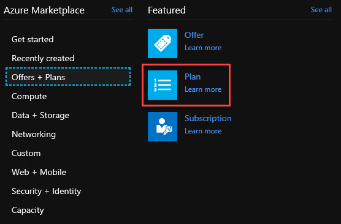

3.  In the New Plan blade, provide the following inputs:

    -   Display name: **PROD-Plan-1**

    -   Resource name: **prod-plan-1**

    -   Resource group (Create new): **ContosoFinance**

        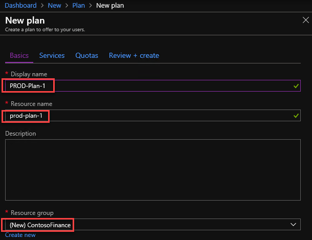

4.  Click **Services**.

    

5.  Next, check each of the **Services** listed, and click **Next: Quotas**.

    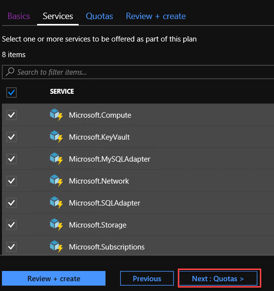


6.  For Quotas, click through and select the default quota presented **[skipping]** the Microsoft.SQLAdapter. Once this is complete, click **Create New** by Microsoft.SQLAdapter.

    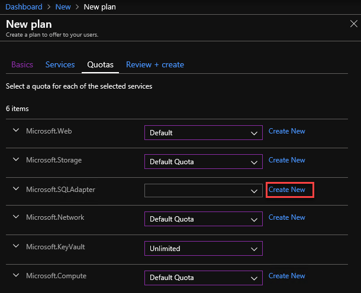


7.  Complete the **Create Quota** blade using these inputs. Then, click **Create**.

    -   Quota Name (no spaces allowed): **SQLQuota**

    -   Maximum size of all databases (GB): **50**

    -   Maximum number of databases: **20**

    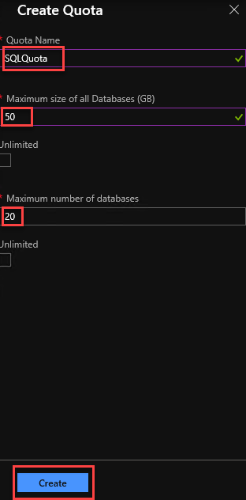

8. Click **Review + Create** and then confirm the creation. 

    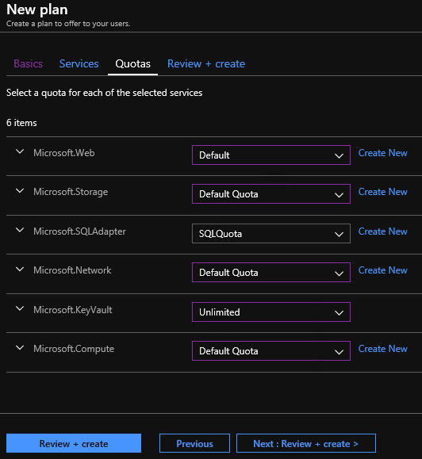

9. The Plan will deploy immediately. Click **+ Create a resource** in the Azure Stack Admin portal.


10. Click **Offers + Plans** followed by **Offer**.

    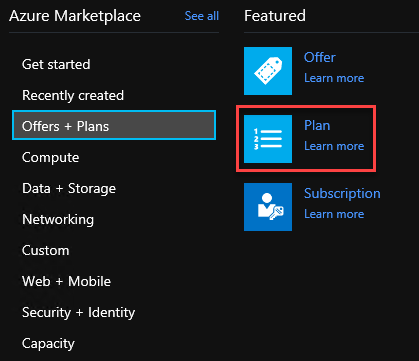

11. Update the New offer blade using the following inputs. Then, click **Next: Base plans**.

    -   Display Name: **PROD-Offer-1**

    -   Resource Name: **prod-offer-1**

    -   Resource group: **Use existing / ContosoFinance**

    -   Base plans: **PROD-Plan-1**

        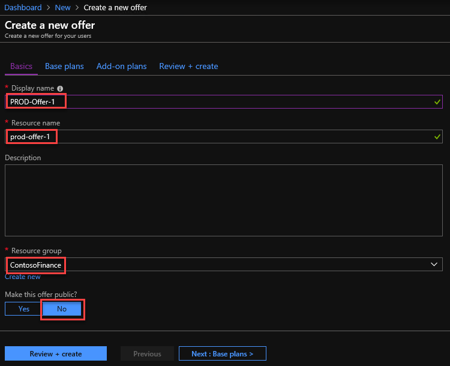

12. On the **Base plans** blade, check **prod-plan-1** and click **Review + create** and then **Create**.

    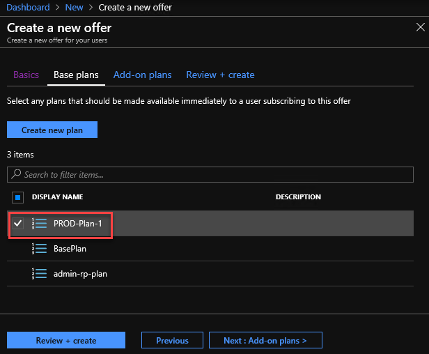

13. Open the new offer after it is created. Notice the portal shows a warning stating: "**This offer is private, and users cannot see it**." To fix this, click the **Change state** button.

    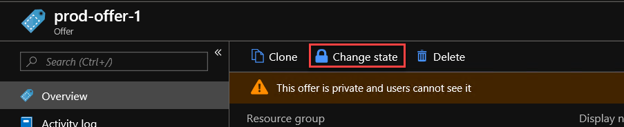

14. Select **Public**.

    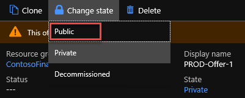

15. The portal will immediately provide a notification about the update to the offer.

    

16. Next, open a new browser tab, and navigate to Azure Stack tenant portal and click **Get Subscription**.

    ```
    https://portal.local.azurestack.external
    ```

    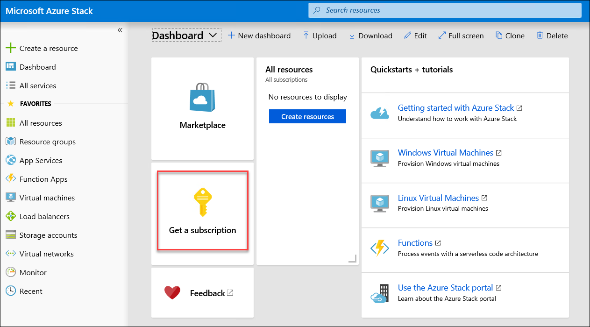

    > **Note**: This is the User portal where Contoso Finance will use to provision and manage their Azure Stack service.


17. Give it the name: **Production** and select the **PROD-Offer-1** and click **Create**.

    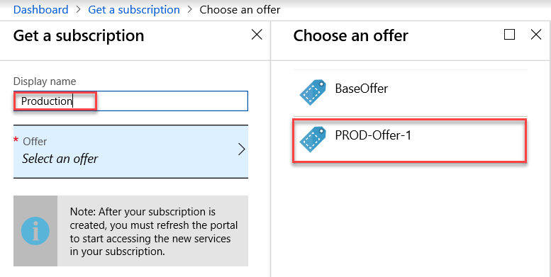

18. You will need to Refresh the window to start using the new Subscription.

    

19. Once the portal refreshes, click **All Services \> Subscriptions**.

20. The Production Subscription will load, and you can click to review.


## Exercise 2: Deploy Contoso Financial Web Application

Duration: 15-30 minutes

In this exercise, you will provision a website using the Azure Stack portal. The Web App will leverage the SQL DB running in Azure Stack. This is the front-end website that customers will see when browsing for a Mortgage or other financial services products.

### Task 1: Create the Web App

1.  From within the Azure tenant portal, click **+Create a resource -\> Web + Mobile -\> Web App.**

2.  On the **Web App** blade, select **App Service plan/Location**.

    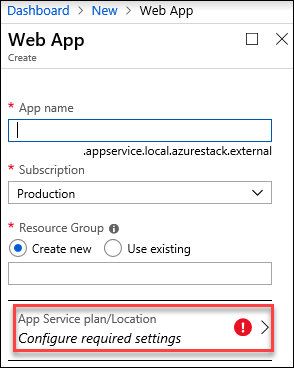

3.  Create a new App Service plan called **ContosoFinanceWebPlan** with the **D1 Shared** pricing tier and click **OK**.

    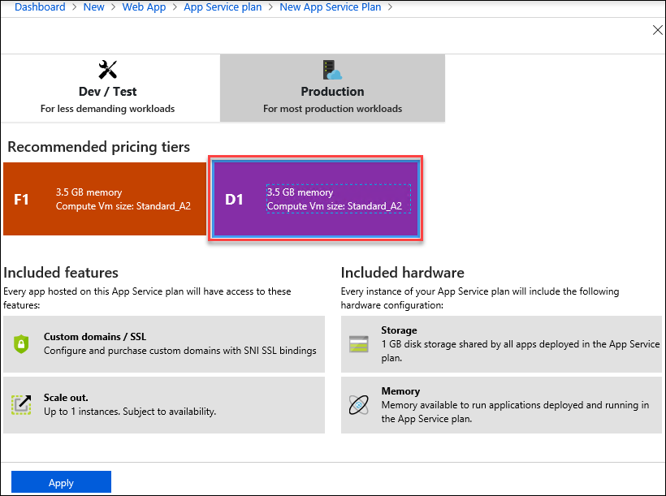

4.  On the **Web App** blade, specify the following configuration, and click **Create:**.

    -   App Name: **Specify a unique and valid URL (until the green check mark appears)**.

    -   Resource group: **ContosoFinanceWeb**

        

### Task 2: Provision an Azure Storage Account

1.  In the Azure Tenant portal, click **+New, Data + Storage,** and **Storage account**.

    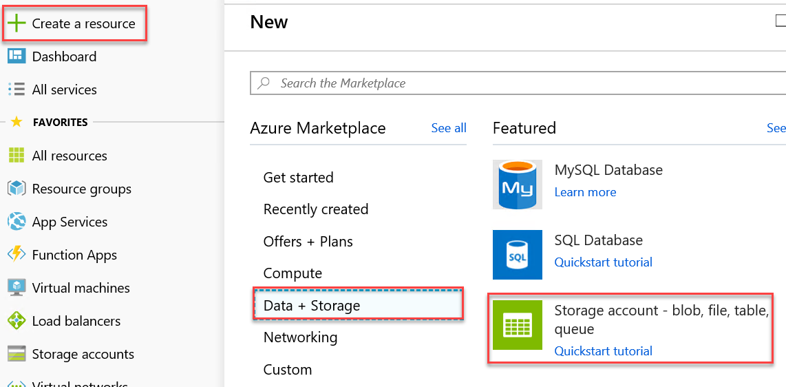

2.  On the **Create storage account** blade, specify the following configuration options:

    -   Name: **Unique value for the storage account (ensure the green check mark appears)**.

    -   Resource Group: **ContosoFinanceWeb**

        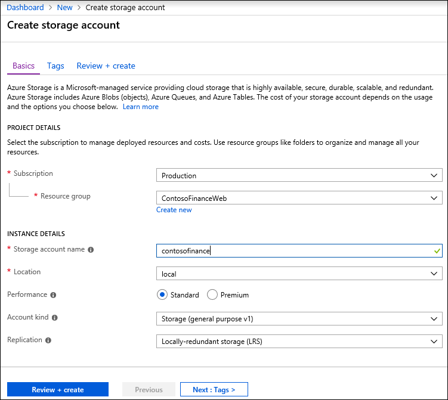

3.  Click **Create**.

    

4.  After the storage account has completed provisioning, open the storage account by clicking **Storage accounts** in the left navigation, and then click the storage account name.

5.  On the **Storage** account blade, scroll down, and select the **Access keys** option.

    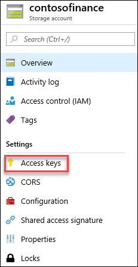

6.  On the **Access keys** blade, click the copy button by **Key** to copy the **key1** key value. Put the value in notepad for later reference.

    

    

7.  On the **Access keys** blade, click the copy button by **Connection string** to copy the **key1** connection string value. Put the value in notepad for later reference.

    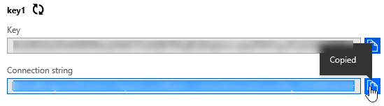

    

    > **Note:** If the copy to clipboard button does not work, you may need to highlight the key and copy by right-clicking. Some versions of Internet Explorer have issues with this functionality.


### Task 3: Deploy SQL DB on Azure Stack 

1.  In the Azure Stack Tenant portal, click **+ Create a Resource**, **Data + Storage** followed by **SQL Database**.

    

2.  Complete the **Create Database** using the following inputs:

    -   Database Name: **ContosoFinanceWebDB**

    -   Max Size in MB: **250**

    -   Resource group: **ContosoFinanceWeb**

    -   Location: **Local**

        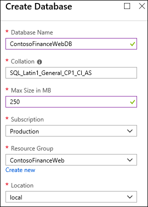

3.  Next, click **SKU**.

    

4.  Select the **MSSQL2017** SKU.

    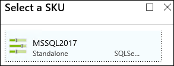

5.  Click **Login**.

    

6.  Click **Create a new login**.

    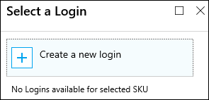

7.  Complete the **New Login** blade using these inputs and click **OK**:

    -   Database Login: **ContosoFinanceWebDB**

    -   Password/Confirm Password: **Demo@pass123 - Note: Upper case D**

        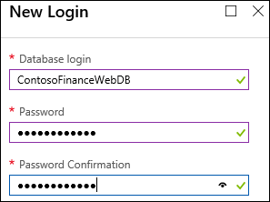

8.  Review the **Create Database** blade and click **Create**.

    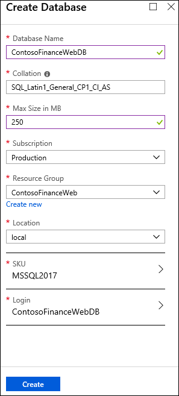

9.  Once the deployment completes, use the Azure Stack User portal to locate the **ContosoFinanceWebDB** in the **ContosoFinanceWeb** resource group. Click to examine the details of the new SQL DB running in Azure Stack PaaS.

    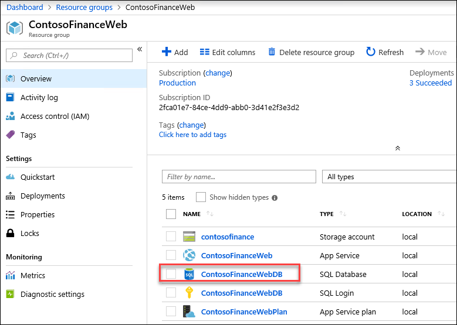

10. On the **ContosoFinanceWebDB**, the details highlight the connection string and copy to the clipboard. Retain this text for later in the lab by copying to notepad.

    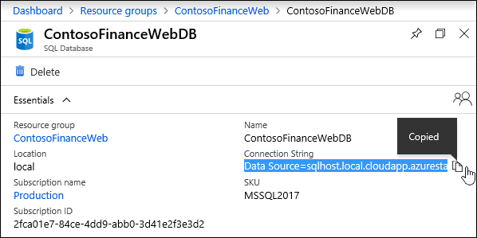

    > **Note:** If the clipboard copy does not work, you can use the following sample text for your environment. You will need to alter this text to match your configuration.

    ```
    Data Source=X.X.X.X,1433;Initial Catalog=ContosoFinanceWebDB;User ID=ContosoFinanceWebDB;Password=demo\@pass123
    ```

### Task 4: Update the configuration strings

1.  Navigate to your web app and on the left pane of the Web App, click on **Application settings**.

    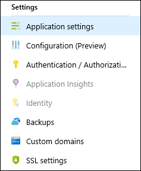

2.  Scroll down and locate the **Application settings** section.

    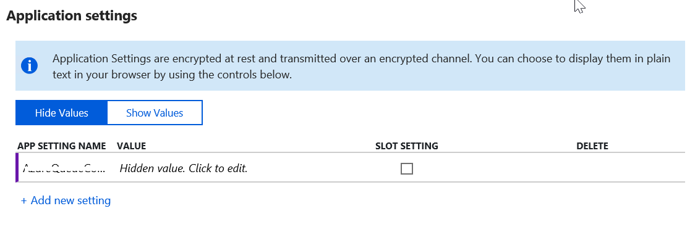

3.  Add a new **App setting** with the following values:

    -   App setting name: **AzureQueueConnectionString**

    -   Value: **Enter the Connection String for the Storage Account that was just created**.

        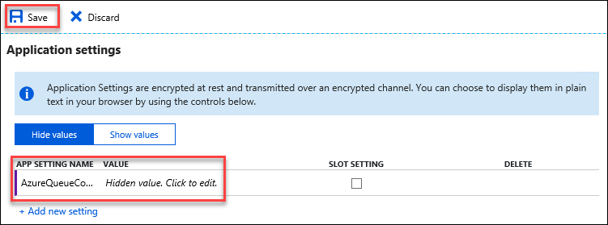

4.  Move to your Notepad with the SQL Server Connection string copied from Azure Stack. Update the following items in the string:

    -   Password: **Demo@pass123**

5.  Locate **Connection Strings** below App settings in the Azure tenant portal, add a new **Connection String** with the following values:

    -   Name: **ContosoFinance**

    -   Value: **Enter the Connection String for the SQL Database in Azure Stack you just updated**.

    -   Type: **SQLAzure**

        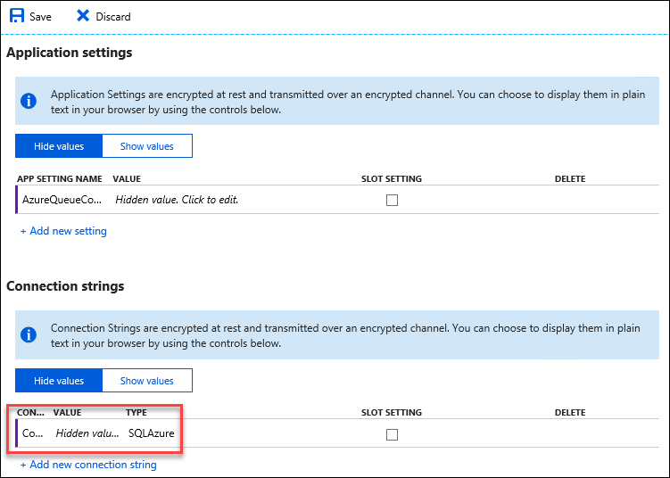

6.  Click **Save**.

### Task 5: Publish the Contoso Financial Web Application

The current version of the Azure Stack App Service Provider does not enable the deployment center feature yet. To enable the classic deployment feature, navigate to this URL before following the next steps:

```
https://portal.local.azurestack.external/?websitesExtension_oldvsts=true
```

1.  From within the web app blade, click on **Deployment Options**.

    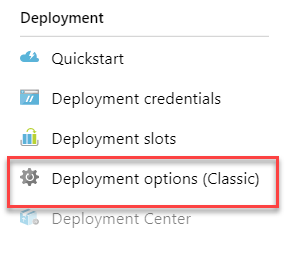

2.  Click **Choose Source**, and then **External Repository**.

    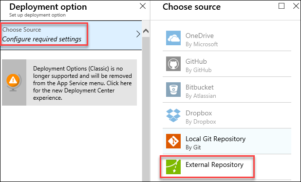

3.  Specify the following  as the **Repository URL** and click **OK**.

    ```
    https://github.com/opsgility/contosofinanceweb
    ```

4.  Click on the Deployment options button and monitor until the application is deployed.

5.  Click the Overview tab, and then click the URL. You should see the Contoso Finance web app.

    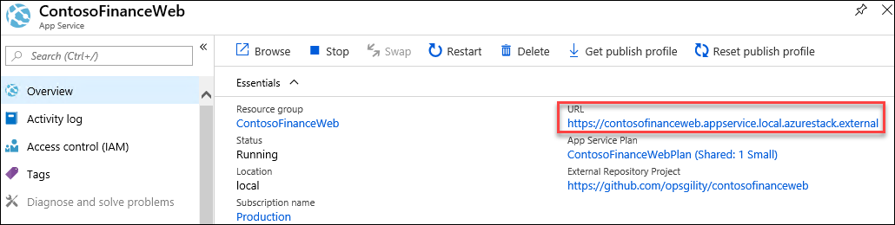

    > **Note:** You may get an error about CORS. This can be ignored, as it will be configured later in the lab.

6.  Validate the website by clicking the **Products** link on the menu. If the products return, the connection to the database is successful.

    

## Exercise 3: Deploy the customer offers Web API

Duration: 15-30 minutes

In this exercise, you will provision an Azure API App using the Azure Stack portal. This API application is part of the front-end Web Applications and makes recommendations to the user on products the company wishes to highlight. The API App will leverage the SQL Database deployed previously.

### Task 1: Provision the offers Web API App

1.  Using the Azure Stack Tenant portal, click **+Create a resource**, **Web + Mobile**, and click **API App**.

    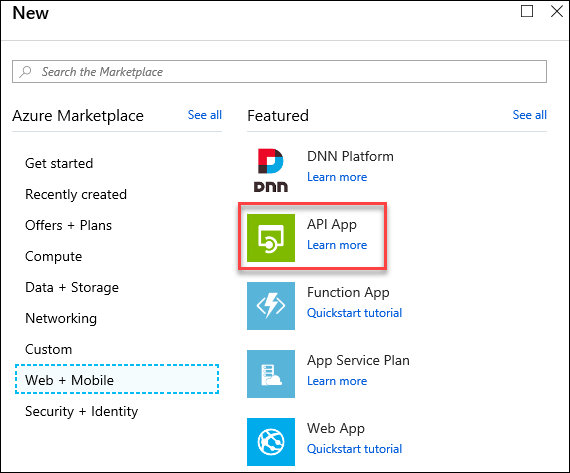

2.  Click on **Create**.

3.  On the new **API App** blade, **specify a unique name** for the App Name, and ensure the previously used Resource Group and App Service Plan is selected.

4.  After the values are accepted click **Create**.

5.  On the **App Service** blade, scroll down, and click on **CORS** within the API section of the left pane.

    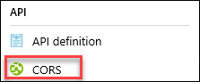

6.  In the **ALLOWED ORIGINS** text box specify \* and click **Save**.

    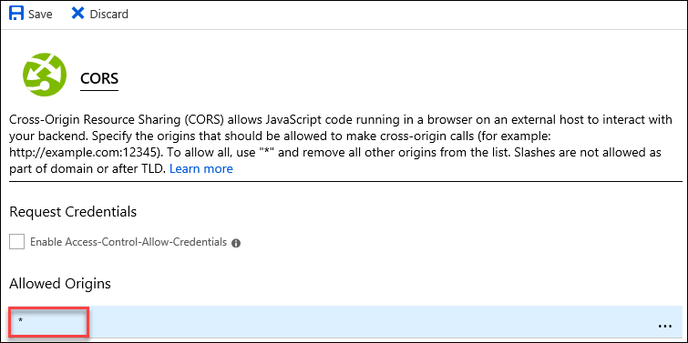

7.  On the **App Service** blade for the Offers API, click on **Application settings**.

    

8.  Scroll down, and locate the **Connection strings** section.

    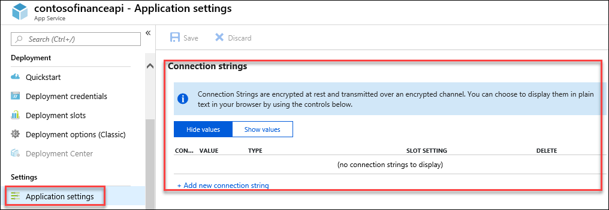

9.  Locate **Connection Strings** below App settings in the Azure global portal.  Add a new **Connection String** with the following values:

    -   Name: **ContosoFinance (must match exactly -- case sensitive)**

    -   Value: **Enter the Connection String for the SQL Database in Azure Stack you just updated**.

    -   Type: **SQL Database**

        

10. Click **Save**.

### Task 2: Deploy the Contoso.Apps.Financial.Offers project

1.  From within the API app blade, click on **Deployment options**.

    

2.  Click **Choose Source**, and then **External Repository**.

    

3.  Specify the following as the **Repository URL** and click **OK**.

    ```
    https://github.com/opsgility/contosofinanceoffers
    ```

4.  Click on the Deployment options button and monitor until the application is deployed.

5.  On the **Overview** tab, copy the URL for the web app to the clipboard.

### Task 3: Update the Application Settings of the Web App with the API URL

1.  Open the ContosoFinanceWeb application in the Azure Stack Tenant portal and click on Application settings

    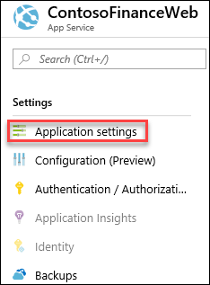

2.  Scroll down and locate the **App settings** section

    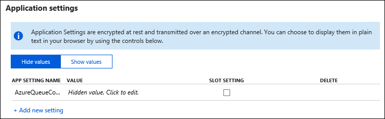

3.  Add a new **App Setting** with the following values:

    -   Key: **offersAPIUrl**

    -   Value: Enter the **HTTPS** URL for the Offers API App with **/api/get** appended to the end.
    
    Example: <https://contosofinanceapi.appservice.local.azurestack.external/api/get>

       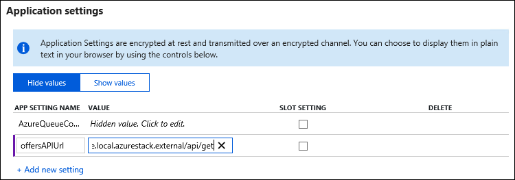

4.  Click on **Save**.

    > **Note:** Ensure the API URL is using **SSL** (https://), or you will see a CORS errors when loading the webpage.

5.  Connect to the URL of the **contosofinanceweb** Web App.

    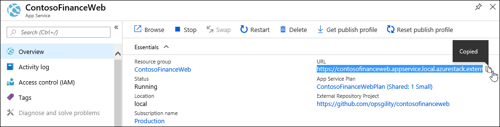

6.  On the homepage, you should see the latest offers populated from the offers API.

    

## Exercise 4: Automating backend processes with Azure functions 

Duration: 15-30 minutes

Contoso wants to automate the process of generating applications in PDF format and using Azure Functions. In this exercise, you will provision a Function App using the Azure Stack portal. This Function App will watch the Azure Storage Queue for a message that the web application has submitted, process the application creating a PDF and storing it in Azure Blob Storage.

### Task 1: Create an Azure function to generate PDF receipts

1.  From your Azure Stack Host, navigate to the following repository: and click **Clone or download**, and then **Download ZIP**. After the file is downloaded, extract it to a new folder.

    ```
    https://github.com/opsgility/contosofinancefunction
    ```

    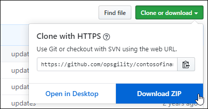

2.  From the Tenant portal, click **+Create a resource**, **Web + Mobile**, and then click **Function App**.

    

3.  Complete the **Create Function App** blade using the following inputs:

    -   App name: **Specify a unique name**.

    -   Resource Group: **ContosoFinanceWeb**

    -   Hosting Plan: **App Service Plan**

    -   App Service plan/Location: **ContosoFinanceWeb**

    -   Storage Account: **Select your storage account**.

        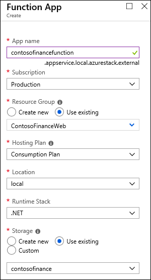

4.  Click **Create**.

5.  Using the Azure Stack portal, open the Function App you just created, click **Functions** and then **New Function**.

    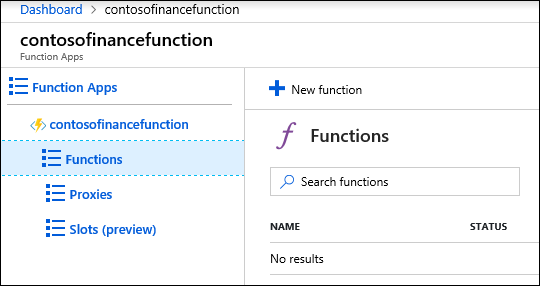

6.  Locate the **Queue trigger** box and click **C\#**.

    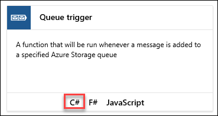

7.  Complete the **New Function** blade using the following inputs and click **Create**.

    -   Language: **C\#**

    -   Name: **QueueTriggerGeneratePDF**

    -   Queue name: **receiptgenerator (must be this exact text)**

        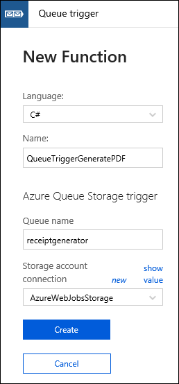

8.  Expand the View files area on the right of the code window, and click **Upload**.

    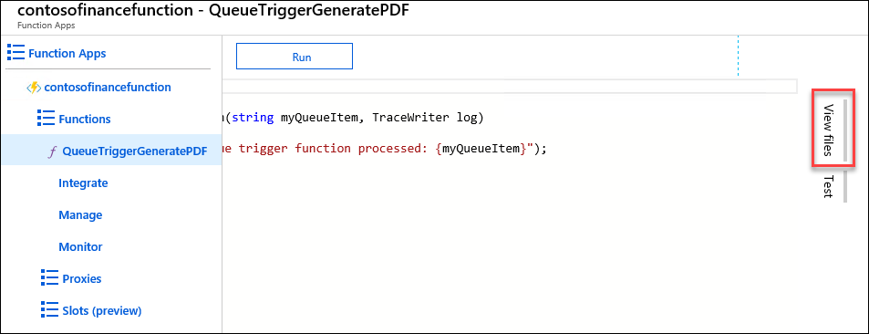
    
    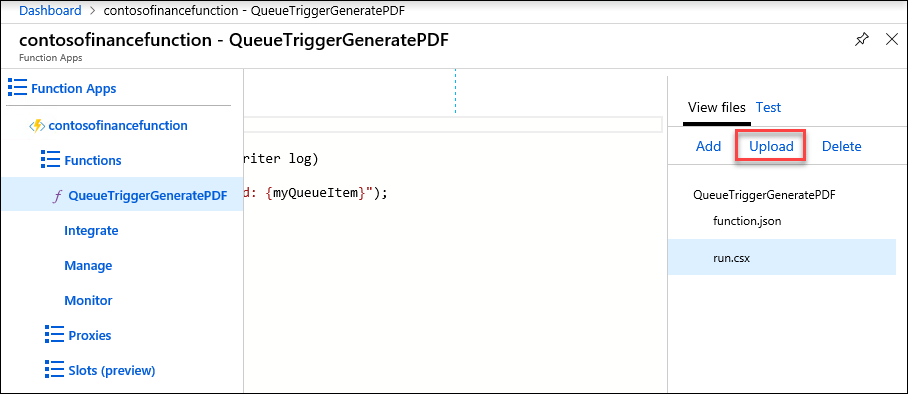

9.  Upload the following files from your LABVM in the **C:\\HOL\\contosofinancefunction-master** folder:

    -   CreatePdfReport.csx

    -   Project.json

    -   run.csx

    -   StorageMethods.csx

    -   ViewModels.csx

10. Click on **run.csx** to refresh the code editor.

    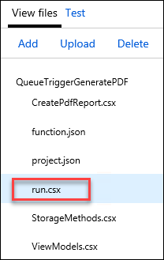

11. Select the **name of your function app** followed by **Application settings**.

    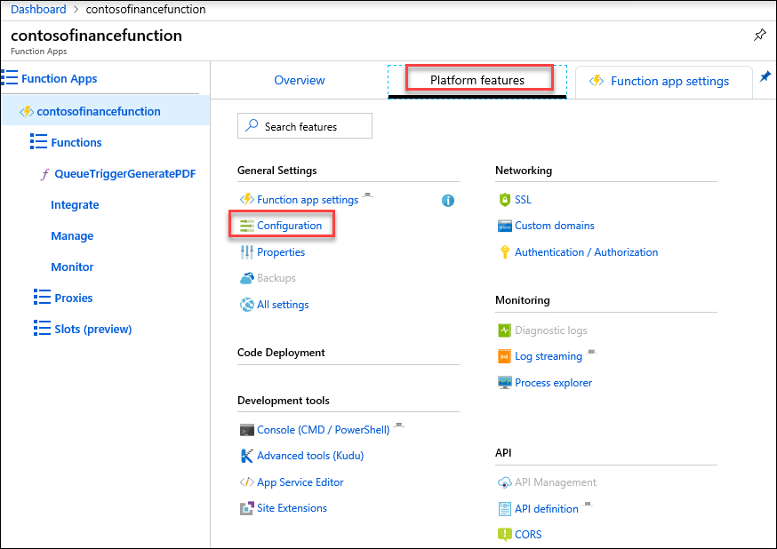

12. Scroll down to the **Application settings** and click **+Add new setting** to add a storage connection. This storage account will be used to write the PDFs to blob storage.

    -   Name: **contosofinancestorage (must be this name exactly)**

    -   Value: **Paste the connection string for the storage account created earlier in the lab**.

13. Locate **Connection Strings** below Application settings in the Azure tenant portal, and click **+Add a new** **Connection String** with the following values:

    -   Name: **ContosoFinance (must match exactly -- case sensitive)**

    -   Value: **Enter the Connection String for the SQL Database**.

    -   Type: **SQL Azure**

        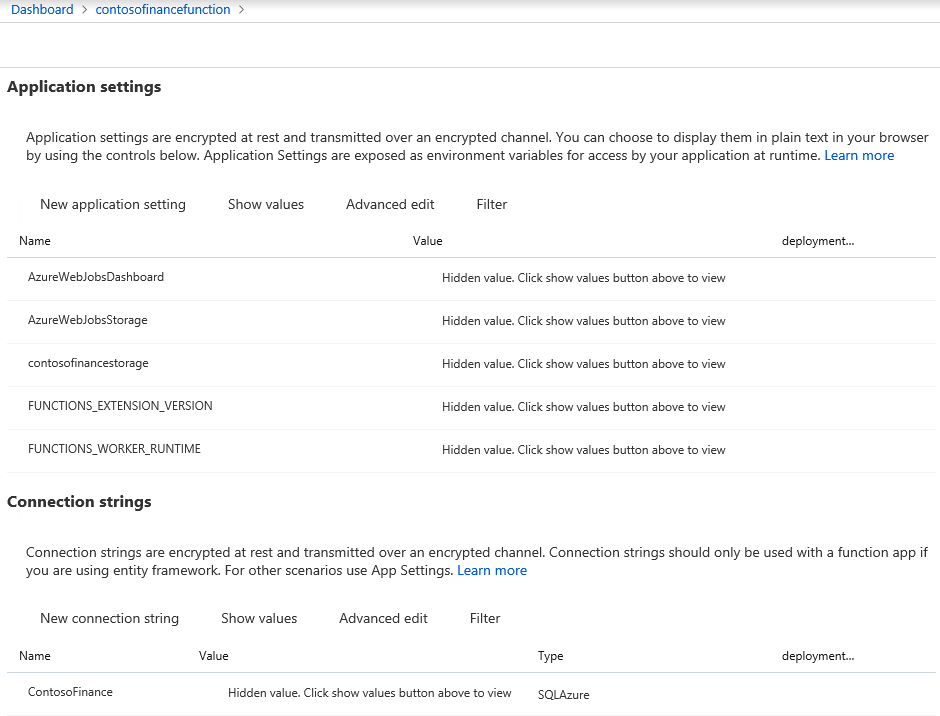

14. Scroll back up to the top of the blade and click **Save**.

    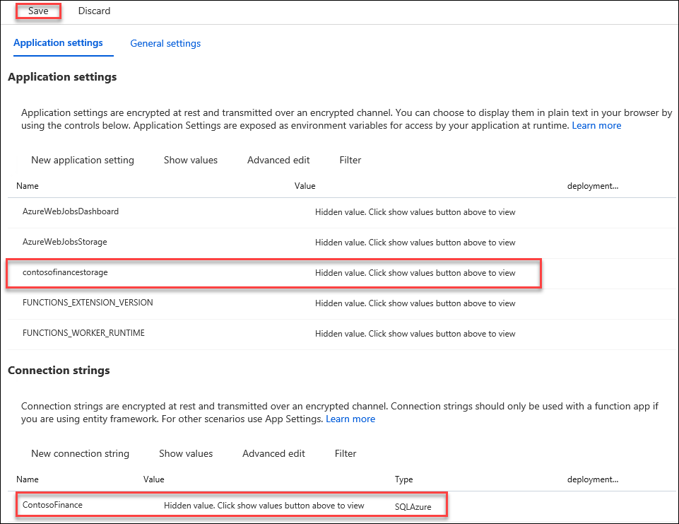

## Exercise 5: Deploy Contoso Finance Admin website

Duration: 15-30 minutes

In this exercise, you will provision the admin website to be used by employees to review applications submitted.

### Task 1: Provision the Contoso Finance Admin Web App

1.  In the Azure tenant portal, click **+Create new resource**, **Web + Mobile**, and select **Web App**.

2.  Specify a **unique URL** for the Web App, ensure the **same App Service Plan** as well as the **ContosoFinanceWeb** resource group you have used throughout the lab are selected.

    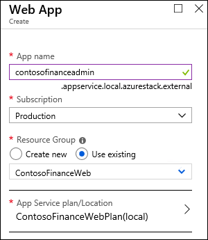

3.  After the values are accepted, click **Create**.

4.  Navigate to the **App Service** blade for the Admin app recently provisioned.

    

5.  On the **App Service** blade, click on **Application settings** in the left pane.

    

6.  Scroll down and locate the **Connection strings** section.

    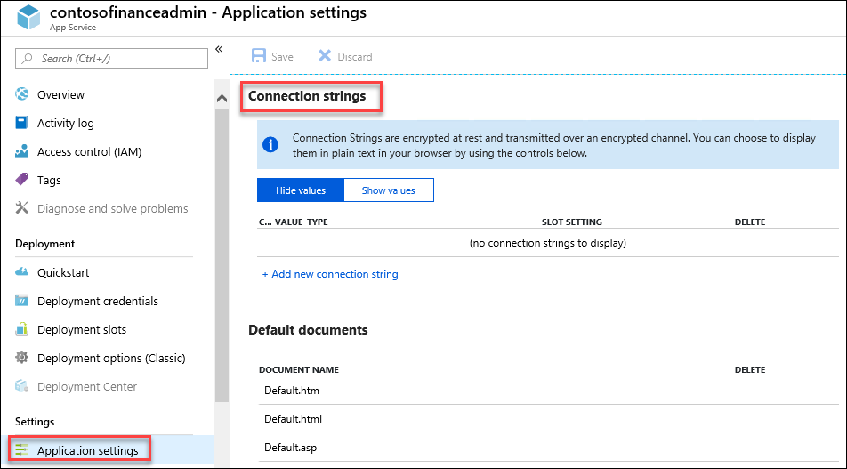

7.  Locate **Connection Strings** below App settings in the Azure tenant portal add a new **Connection String** with the following values:

    -   Name: **ContosoFinance**

    -   Value: **Enter the Connection String for the SQL Database in Azure Stack you just updated**.

    -   Type: **SQL Database**

        

8.  Click **Save**.

### Task 2: Deploy the call center admin Web App from Visual Studio

1.  From within the web app blade, click on **Deployment options**.

    

2.  Click **Choose Source**, and then **External Repository**.

    

3.  Paste the following as the **Repository URL** and click **OK**.

    ```
    https://github.com/opsgility/contosofinanceadmin
    ```

4.  Click on the Deployment options button and monitor until the application is deployed.

5.  On the **Overview** tab, copy the URL for the web app to the clipboard.

6.  Connect to the **contosofinanceadmin** portal to see the list of applications that have been completed.

    

>**Note**: In production this application would be secured using Azure AD for authentication purposes.

7.  Since the application is fully deployed, you will want to see it work end to end. Open the URL for the contosofinanceweb Web App. The application will load in the browser.

    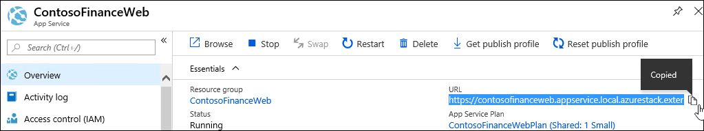

    

8.  Notice how the API application loaded the Today's Offers area. Click through to one of the products and add it to your cart.

    

9.  Click **Apply**.

    

10. Complete the Application and click **Continue** followed by **Complete Application** on the confirmation screen.

    

    

11. Now, to act as an employee, open the Admin application to see the submitted applications. Click **Details** on one of the applications.

    

    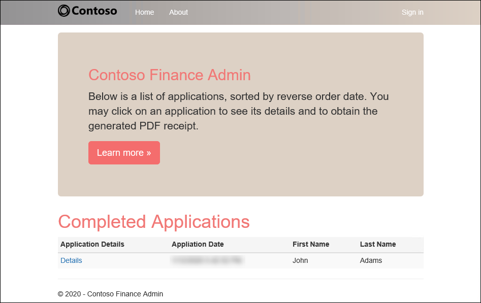

12. Notice the details of the application. This data is stored in SQL DB running in PaaS on Azure Stack. Click **Download application to view a sample PDF**.

    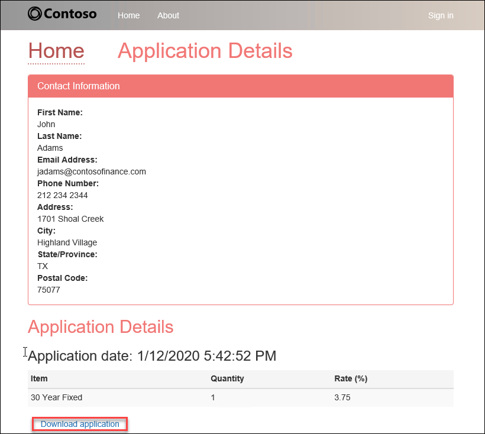

## After the hands-on lab 

Duration: 10 minutes

In this final task you will clean up the Azure Resources that you have create for the hands-on lab. This task is optional.

1.  If provisioned using the Azure Stack Developer Kit in an Azure VM, delete the resource group your Azure Stack Host VM is running in.

2.  If running on your own Developer Kit, delete all the resource groups from the Azure Stack portal that you created during the execution of this lab.

You should follow all steps provided *after* attending the Hands-on lab.
