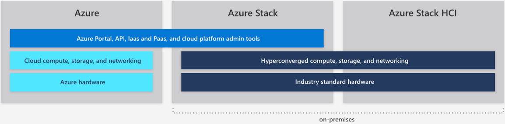



Azure Stack Hub

Whiteboard design session student guide

July 2020

Information in this document, including URL and other Internet Web site references, is subject to change without notice. Unless otherwise noted, the example companies, organizations, products, domain names, e-mail addresses, logos, people, places, and events depicted herein are fictitious, and no association with any real company, organization, product, domain name, e-mail address, logo, person, place or event is intended or should be inferred. Complying with all applicable copyright laws is the responsibility of the user. Without limiting the rights under copyright, no part of this document may be reproduced, stored in or introduced into a retrieval system, or transmitted in any form or by any means (electronic, mechanical, photocopying, recording, or otherwise), or for any purpose, without the express written permission of Microsoft Corporation.

Microsoft may have patents, patent applications, trademarks, copyrights, or other intellectual property rights covering subject matter in this document. Except as expressly provided in any written license agreement from Microsoft, the furnishing of this document does not give you any license to these patents, trademarks, copyrights, or other intellectual property.

The names of manufacturers, products, or URLs are provided for informational purposes only and Microsoft makes no representations and warranties, either expressed, implied, or statutory, regarding these manufacturers or the use of the products with any Microsoft technologies. The inclusion of a manufacturer or product does not imply endorsement of Microsoft of the manufacturer or product. Links may be provided to third party sites. Such sites are not under the control of Microsoft and Microsoft is not responsible for the contents of any linked site or any link contained in a linked site, or any changes or updates to such sites. Microsoft is not responsible for webcasting or any other form of transmission received from any linked site. Microsoft is providing these links to you only as a convenience, and the inclusion of any link does not imply endorsement of Microsoft of the site or the products contained therein.

© 2020 Microsoft Corporation. All rights reserved.

Microsoft and the trademarks listed at https://www.microsoft.com/en-us/legal/intellectualproperty/Trademarks/Usage/General.aspx are trademarks of the Microsoft group of companies. All other trademarks are property of their respective owners.

**Contents**

<!-- TOC -->

- [Azure Stack Hub whiteboard design session student guide](#azure-stack-whiteboard-design-session-student-guide)
  - [Abstract and learning objectives](#abstract-and-learning-objectives)
  - [Step 1: Review the customer case study](#step-1-review-the-customer-case-study)
    - [Customer situation](#customer-situation)
    - [Customer needs](#customer-needs)
    - [Customer objections](#customer-objections)
    - [Infographic for common scenarios](#infographic-for-common-scenarios)
  - [Step 2: Design a proof of concept solution](#step-2-design-a-proof-of-concept-solution)
  - [Step 3: Present the solution](#step-3-present-the-solution)
  - [Wrap-up](#wrap-up)
  - [Additional references](#additional-references)

<!-- /TOC -->

#  Azure Stack Hub whiteboard design session student guide

## Abstract and learning objectives 

In this whiteboard design session, you will work with a group to design a hybrid cloud architecture using a combination of the Azure public cloud and Azure Stack Hub. This functional architecture will enable customers to leverage their investments in Azure as a "cloud platform," rather than Azure as a "place."

At the end of the session, you will be able to determine which systems are good candidates for the Azure public cloud, and which are better suited on Azure Stack Hub.

## Step 1: Review the customer case study 

**Outcome**

Analyze your customer's needs.

Timeframe: 15 minutes

Directions: With all participants in the session, the facilitator/SME presents an overview of the customer case study along with technical tips.

1.  Meet your table participants and trainer.

2.  Read all of the directions for steps 1-3 in the student guide.

3.  As a table team, review the following customer case study.

### Customer situation

Contoso Finance is one of the largest banks in the United States with a significant amount of their revenue coming from their residential mortgage business. Their mortgage business is headquartered in Dallas, Texas. During a meeting with the newly appointed CTO Doreen Newton, the IT team learned that Contoso is shifting to a cloud first strategy after seeing firsthand the advantages of the cloud from Doreen's previous role leading her prior company through a digital transformation. Her message, "I have seen how applications and infrastructures are deployed and run using Microsoft Azure with both PaaS and IaaS services. These capabilities can transform Contoso with more agility and long-term cost effectiveness." resonated with other members of the IT organization.

Contoso's current workloads run in their Dallas based datacenter using VMWare based virtual machines. One of the primary applications the company is interested in modernizing to take advantage of the cloud is a consumer facing mortgage application. This application is handling new mortgage requests and facilitating access of consumers to their current mortgage information. The current implementation of the mortgage application is hosted in a public facing website on Microsoft Internet Information Server (IIS) with a backend database using SQL Server 2014. The application has several modules that run as Windows Services. These modules are responsible for running credit checks and generating PDFs for transactions. The application uses Microsoft Message Queue (MSMQ) for interacting between modules. The application also allows customers to download several publicly accessible PDF files that provide an overview of the bank's mortgage related products.

The current implementation of mortgage application relies on a third party load balancer to distribute requests across a pair of identically confgured web servers, with redundant application servers operating in the active/active mode, and the database tier leveraging SQL Server Always On availability group in the synchronous-commit mode. The database is also replicated asynchronously to the Contoso's disaster recovery site in Tulsa, Oklahoma. The recovery site hosts instances of web and application servers, configured identically to their production counterparts. As part of the disaster recovery plan, the external DNS records pointing to the public endpoint of the mortgage application would be modified to match the public IP address associated with the Tulsa datacenter edge routers.

In addition to plans for modernizing its technology, Contoso is also interested in expanding its business mortgage origination business to Mexico and Canada. Considering the matching projected timelines of these two initiatives, the IT team wants to explore the possibility of leveraging, whenever applicable, Azure technologies, not only for its United States-based workloads but also when developing and implementing its international operations. However, as the Contoso's compliance team has pointed out, operating internationally introduces regulatory challenges. In particular, Contoso must ensure that it protects personally identifiable information (PII) according to laws governing financial records in each country. Some of information provided by international customers must remain at its country of origin and would need to be excluded from any data set transmitted to Azure or to Contoso's United States-based locations.

At the same time, Contoso's strategy oversight committee emphasizes the significance of collecting comprehensive data associated with all of mortgage operations across the company, which feeds its custom Enterprise Resource Planning (ERP) and Customer Relationship Management (CRM) systems. Currently, these custom systems extract data directly from the SQL Server database that serves as the data store for the customer facing mortgage application. Due to existing dependencies built into the modules processing data feeds into the ERP and CRM systems, the intention is to keep the current model, with the single, centalized database for mortgage originations data.

While the management team of Mortgage Unit within Contoso is open to modernizing technologies that deliver its applications to customers, its members are concerned about the resiliency of a hybrid solution that would result in moving its mission critical mortgage processing application out of Contoso owned datacenters. While currently there are no explicitly stated Recovery Point Objective (RPO) and Recovery Time Objective (RTO), the business wants to ensure that the proposed solution includes high availability and disaster recovery provisions. The management team wants to make sure that, at the very least, any potential downtime and data loss are minimized to the extent equivalent to that offereed by the current implementation.

Another important consideration concerns the future management and maintenance model optimized for the clould first strategy. CTO Doreen Newton is a vocal advocate of consistency, regardless of whether compute, storage, or networking resources reside on-premises, in Azure, or a datacenter managed by a third party hosting provider. Contoso IT team currently relies on System Center Operations Manager for monitoring their on-premises servers, but it is yet unclear how to design and implement the approach promoted by its CTO once their workloads are migrated to a private or a public cloud. From the management standpoint, the team has been evaluating PowerShell Desired State Configuration on its Windows and Linux servers in order to eliminate configuration drift, which currently is one of the pain points negatively affecting the stability of the compute environment.

In addition, as a result of a recent acquisition of a financial analytics company named Fabrikam, based in Houston, Texas, Contoso IT management team decided to integrate a number of Fabrikam's internally developed applications to process and analyze the customer data being used by the Contoso's customer facing mortgage application. Fabrikam has skilled development and infrastructure teams, with extensive Azure experience and its own Azure Active Directory tenant. Contoso is very interested in leveraging that experience and plans to offer the Fabrikam IT team sufficient level of autonomy when working on the integration tasks. That autonomy will need to account for the emerging cloud strategy and allow the Fabrikam IT team to offer to their users cloud resources required for application development, implementation, and maintenance. At the same time, Contoso will need to ensure proper governance that facilitates compliance with its corporate standards throgh automation and centralized control of the content of a service catalog offered to Fabrikam users. 

During the early planning stages of the new cloud strategy, Contoso IT team realized that the constraints applicable to its international locations also play significant role within the United States. As it turned out, corporate compliance policies and regulatory mandates preclude the ability to move some of their customer, on-premises resident data to US based Azure regions. "This was a cause for great concern, as this means Contoso may not be able to move to cloud-based services as we initially envisioned" says Max Rubin VP of Network Engineering. Doreen Newton took on the challenge to investigate alternatives to allow Contoso to proceed with getting the benefits of the cloud while not breaking rules for corporate compliance.

To help design a solution using Azure technologies, Contoso has engaged a Microsoft Cloud Partner and Service Provider FusionTomo (FT). FT is a full-service hosting provider in North America certified to deliver Azure services with connectivity solutions and partnerships to provide ExpressRoute and other telecom services. They have a number of datacenters around the world, including Dallas, Denver, Chicago, Las Vegas, Toronto, and Mexico City.

Contoso has expressed to FT the need to embrace Microsoft Azure technologies as well as technologies that will help their organization with a more agile continuous integration and continuous deployment model for application deployment. FT was made aware of the compliance and regulatory challenges it encountered, along with the set of business requirements that must be satisfied as Contoso transitions towards its longer term goals. Contoso's IT management team also underscored the need for cooperation with Fabrikam's integration teams, including the intent to delegate some of the infrastructure management tasks. 

In addition, Contoso has tasked FT with implementing a hosted environment that will accommodate requirements regarding integration work to be carried out by Fabrikam. It was agreed that this implementation will account for the need expressed by Contoso's internal audit team regarding its ability to track all of the infrastructure changes. Furthermore, for compliance purposes, the delegation model that will provide Contoso and Fabrikam staff with insight into the hosted environment must comply with the principle of least privilege. Finally, to satisfy Contoso governance requirements, FT must document standard operating procedures that will be carried out within the hosted infrastructure. 

### Customer needs 

Contoso is looking for FT to provide the following for their expansion into North America:

1.  Design a hybrid-cloud architecture that is native Azure end-to-end without the need for hosting the application in a Contoso owned, US-based datacenter.

1.  Incorporate into the design high availability and disaster recovery provisions for the customer-facing mortgage application.

1.  Ensure that customer data is not stored in the Azure Cloud while also allowing future applications to be easily deployed in Azure with access to custom data regardless of where they are deployed.

1.  Account for the Contoso's intention to expand its business to Canada and Mexico, including requirements regarding data residency and replication requirements.

1.  Propose management and monitoring approach that would provide consistency in a hybrid environment. 

1.  Deploy the application in a secure manner as to allow for the frontend applications to access the backend customer data.

1.  Establish direct connectivity from the new regional headquarters in Dallas to the deployments. This will allow communication with existing systems and reporting until the rest of Contoso's services are moved to Azure in the future.

1.  Allow for a consistent application deployment model using Azure ARM templates and CI/CD.

1.  Detail the taxonomy that will be leveraged for the hybrid-cloud including the Resource Providers (RP) This includes tenants, regions, subscriptions, offers, plans, services and quotas.

1.  Design an integration model that would allow resource access for both Contoso and Fabrikam users.

1.  Propose a self-service approach that will allow Contoso and Fabrikam developers provision their own resources from the service catalog offered by infrastructure teams. The scope of resources available in service catalog must be controlled centrally, with an oversight by designated Contoso and Fabrikam administrators.

1.  Recommend a procedure for delegation of permissions that would not only allow designated Fabrikam IT admins to manage Contoso infrastructure but also account for the need to provide limited access to the Contoso internal audit team.

1.  Suggest a methodology that would facilitate implementing corporate standards by automating the process of resource provisioning and configuration. 

1.  Document standard operational tasks such as infrastructure backup and log collection.

### Customer objections 

1.  The Mortgage SQL DB cannot be hosted in the public cloud.

1.  Contoso staff is already stretched thin, so minimizing patching of systems and day-to-day management is very important.

1.  Having to manage multiple environments is bound to increase administrative overhead. Is there really a consistent approch we can use in hybrid scenarios?

1.  We have heard that Azure SQL Database does not support replication with on-premises SQL Server-based databases. If so, how can we implement replication of customer data that is not a subject to regulatory restrictions from Canada and Mexico in order to account for our business intelligence requirements?

1.  The developer team acknowledges that the existing application architecture is designed for running on Windows Virtual Machines, but PaaS is the future they envision. How can they move this application forward?

1.  One of the key reasons Contoso wants to go to the cloud is to take advantage of tools and services for automated deployments and application development. Will Azure Stack Hub make it to where we must use two skillsets?

1.  Fabrikam already has its own Azure Active Directory tenant. Will it be necessary to create duplicate accounts for Fabrikam users?

### Infographic for common scenarios

## Step 2: Design a proof of concept solution

**Outcome**

Design a solution and prepare to present the solution to the target customer audience in a 15-minute chalk-talk format.

Timeframe: 60 minutes

**Business needs**

Directions:  With all participants at your table, answer the following questions and list the answers on a flip chart:

1.  Who should you present this solution to? Who is your target customer audience? Who are the decision makers?

2.  What customer business needs do you need to address with your solution?

**Design**

Directions: With all participants at your table, respond to the following questions on a flip chart:

Design a hybrid-cloud architecture using Azure services that will make up the implementation for Contoso.

1.  Identify the overall application design you would propose for modernizing their existing application into Azure.

2.  List the services and components that will be deployed to Azure public cloud. For each, provide their basic function in the system. Determine which Azure Region will be best suited for the deployment.

3.  List the services and components that will be deployed to Azure Stack Hub. For each, provide their basic function in the system.

4.  Determine which identity provider and which identity topology you will use to facilitate authentication and authorization of the Azure Stack Hub environment.

5.  Describe different delegation mechanisms can be employed to facilitate controlled access to Azure Stack Hub resources. 

6.  Establish which common infrastructure management tasks must be implemented and maintained by designated Azure Stack Hub operators. 

7.  Identify how applications such as the Mortgage App and other infrastructure workloads could be deployed in a consistent manner between Azure Public and Azure Stack Hub.

8.  Plan and document Azure Stack Hub taxonomy for this deployment. 

    -   Document each of the following areas of the taxonomy with details on how it will be setup:

        -   Cloud Operator

        -   Region

        -   Tenant

        -   Subscriptions

        -   Plans and quotas

        -   Offers

        -   Services / Resource Providers

    -   Diagram your taxonomy.

9.  Create a network design.

    -   Design network connectivity between the Contoso Regional HQ in Dallas to Azure and Azure Stack Hub that will allow future applications to be deployed in the public cloud or Azure Stack Hub but still provide connectivity to customer or On-Premises data.

**Prepare**

Directions: With all participants at your table:

1.  Identify any customer needs that are not addressed with the proposed solution.

2.  Identify the benefits of your solution.

3.  Determine how you will respond to the customer's objections.

Prepare a 15-minute chalk-talk style presentation to the customer.

## Step 3: Present the solution

**Outcome**

Present a solution to the target customer audience in a 15-minute chalk-talk format.

Timeframe: 30 minutes

**Presentation**

Directions:

1.  Pair with another table.

2.  One table is the Microsoft team and the other table is the customer.

3.  The Microsoft team presents their proposed solution to the customer.

4.  The customer makes one of the objections from the list of objections.

5.  The Microsoft team responds to the objection.

6.  The customer team gives feedback to the Microsoft team.

7.  Tables switch roles and repeat Steps 2-6.

##  Wrap-up 

Timeframe: 15 minutes

Directions: Tables reconvene with the larger group to hear the facilitator/SME share the preferred solution for the case study.

##  Additional references
|    |            |
|----------|:-------------:|
| **Description** | **Links** |
| Azure Stack Hub overview  | <https://azure.microsoft.com/en-us/overview/azure-stack/> |
| Azure Stack Hub use cases | <https://azure.microsoft.com/en-us/overview/azure-stack/use-cases/> |
| Azure Stack Hub features | <https://docs.microsoft.com/en-us/azure/azure-stack/azure-stack-key-features> |
| Azure Stack Hub planning considerations | <https://docs.microsoft.com/en-us/azure/azure-stack/azure-stack-planning-considerations> |
| Azure Stack Hub documentation | <https://docs.microsoft.com/en-us/azure/azure-stack/> |
| Azure Stack Hub Operator documentation | <https://docs.microsoft.com/en-us/azure/azure-stack/> |
| Azure Stack Hub networking | <https://docs.microsoft.com/en-us/azure/azure-stack/user/azure-stack-network-overview/> |
| Azure Stack Hub to Azure Global VPN | <https://docs.microsoft.com/en-us/azure/azure-stack/azure-stack-connect-vpn> |
| Register Azure Stack Hub with your subscription | <https://docs.microsoft.com/en-us/azure/azure-stack/azure-stack-register> |
| Deploy the Azure App Service resource provider | <https://docs.microsoft.com/en-us/azure/azure-stack/azure-stack-app-service-deploy> |
| Deploy the Azure Stack Hub SQL resource provider | <https://docs.microsoft.com/en-us/azure/azure-stack/azure-stack-sql-resource-provider-deploy#deploy-the-resource-provider> |
| Deploy apps to Azure and Azure Stack Hub | <https://docs.microsoft.com/en-us/azure/azure-stack/user/azure-stack-solution-pipeline> |
| White paper | <https://azure.microsoft.com/en-us/resources/azure-stack-an-extension-of-azure/> |
| PowerShell for Azure Stack Hub | <https://docs.microsoft.com/en-us/azure/azure-stack/user/azure-stack-powershell-install> |
| Azure Stack Hub marketplace | <https://docs.microsoft.com/en-us/azure/azure-stack/azure-stack-marketplace-azure-items> |
| What is Azure Arc for servers (preview)? | <https://docs.microsoft.com/en-us/azure/azure-arc/servers/overview> |
| Run an N-tier application in multiple Azure Stack Hub regions for high availability | <https://docs.microsoft.com/en-us/azure-stack/user/iaas-architecture-sql-n-tier-multi-region?view=azs-2002> |
| Replication to Azure SQL Database | <https://docs.microsoft.com/en-us/azure/azure-sql/database/replication-to-sql-database> |
