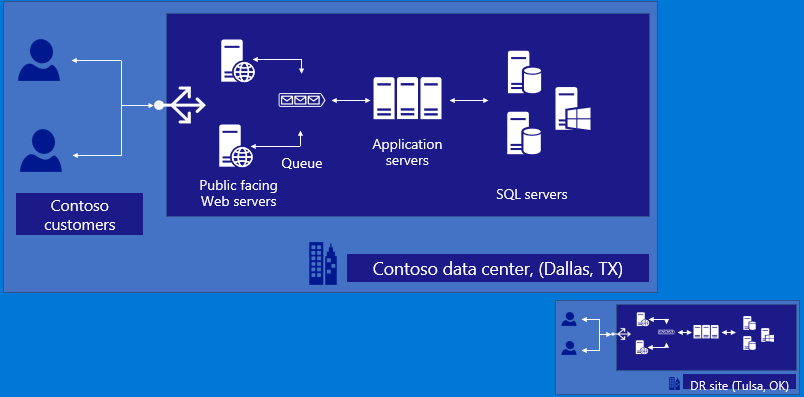
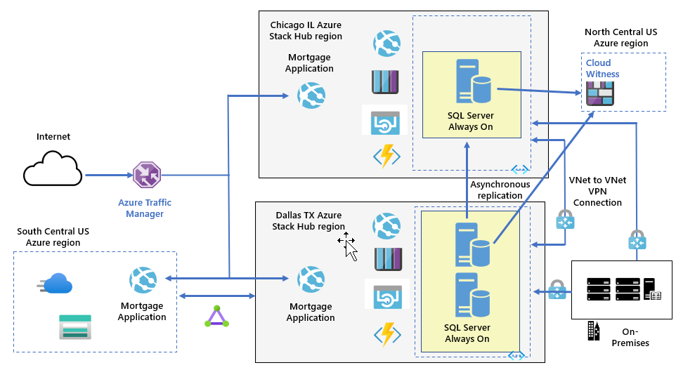



Azure Stack Hub

Whiteboard design session trainer guide

July 2020

Information in this document, including URL and other Internet Web site references, is subject to change without notice. Unless otherwise noted, the example companies, organizations, products, domain names, e-mail addresses, logos, people, places, and events depicted herein are fictitious, and no association with any real company, organization, product, domain name, e-mail address, logo, person, place or event is intended or should be inferred. Complying with all applicable copyright laws is the responsibility of the user. Without limiting the rights under copyright, no part of this document may be reproduced, stored in or introduced into a retrieval system, or transmitted in any form or by any means (electronic, mechanical, photocopying, recording, or otherwise), or for any purpose, without the express written permission of Microsoft Corporation.

Microsoft may have patents, patent applications, trademarks, copyrights, or other intellectual property rights covering subject matter in this document. Except as expressly provided in any written license agreement from Microsoft, the furnishing of this document does not give you any license to these patents, trademarks, copyrights, or other intellectual property.

The names of manufacturers, products, or URLs are provided for informational purposes only and Microsoft makes no representations and warranties, either expressed, implied, or statutory, regarding these manufacturers or the use of the products with any Microsoft technologies. The inclusion of a manufacturer or product does not imply endorsement of Microsoft of the manufacturer or product. Links may be provided to third party sites. Such sites are not under the control of Microsoft and Microsoft is not responsible for the contents of any linked site or any link contained in a linked site, or any changes or updates to such sites. Microsoft is not responsible for webcasting or any other form of transmission received from any linked site. Microsoft is providing these links to you only as a convenience, and the inclusion of any link does not imply endorsement of Microsoft of the site or the products contained therein.

© 2020 Microsoft Corporation. All rights reserved.

Microsoft and the trademarks listed at https://www.microsoft.com/en-us/legal/intellectualproperty/Trademarks/Usage/General.aspx are trademarks of the Microsoft group of companies. All other trademarks are property of their respective owners.

**Contents**

<!-- TOC -->

- [Trainer information](#trainer-information)
  - [Role of the trainer](#role-of-the-trainer)
  - [Whiteboard design session flow](#whiteboard-design-session-flow)
  - [Before the whiteboard design session: How to prepare](#before-the-whiteboard-design-session-how-to-prepare)
  - [During the whiteboard design session: Tips for an effective whiteboard design session](#during-the-whiteboard-design-session-tips-for-an-effective-whiteboard-design-session)
- [Azure Stack Hub whiteboard design session student guide](#azure-stack-whiteboard-design-session-student-guide)
  - [Abstract and learning objectives](#abstract-and-learning-objectives)
  - [Step 1: Review the customer case study](#step-1-review-the-customer-case-study)
    - [Customer situation](#customer-situation)
    - [Customer needs](#customer-needs)
    - [Customer objections](#customer-objections)
    - [Infographic for common scenarios](#infographic-for-common-scenarios)
  - [Step 2: Design a proof of concept solution](#step-2-design-a-proof-of-concept-solution)
  - [Step 3: Present the solution](#step-3-present-the-solution)
  - [Wrap-up](#wrap-up)
  - [Additional references](#additional-references)
- [Azure Stack Hub whiteboard design session trainer guide](#azure-stack-whiteboard-design-session-trainer-guide)
  - [Step 1: Review the customer case study](#step-1-review-the-customer-case-study-1)
  - [Step 2: Design a proof of concept solution](#step-2-design-a-proof-of-concept-solution-1)
  - [Step 3: Present the solution](#step-3-present-the-solution-1)
  - [Wrap-up](#wrap-up-1)
  - [Preferred target audience](#preferred-target-audience)
  - [Preferred solution](#preferred-solution)
  - [Checklist of preferred objection handling](#checklist-of-preferred-objection-handling)
  - [Customer quote (to be read back to the attendees at the end)](#customer-quote-to-be-read-back-to-the-attendees-at-the-end)

<!-- /TOC -->

# Trainer information

Thank you for taking time to support the whiteboard design sessions as a trainer!

## Role of the trainer

An amazing trainer:

-   Creates a safe environment in which learning can take place.

-   Stimulates the participant's thinking.

-   Involves the participant in the learning process.

-   Manages the learning process (on time, on topic, and adjusting to benefit participants).

-   Ensures individual participant accountability.

-   Ties it all together for the participant.

-   Provides insight and experience to the learning process.

-   Effectively leads the whiteboard design session discussion.

-   Monitors quality and appropriateness of participant deliverables.

-   Effectively leads the feedback process.

## Whiteboard design session flow 

Each whiteboard design session uses the following flow:

**Step 1: Review the customer case study (15 minutes)**

**Outcome**

Analyze your customer's needs.

-   Customer's background, situation, needs and technical requirements

-   Current customer infrastructure and architecture

-   Potential issues, objectives and blockers

**Step 2: Design a proof of concept solution (60 minutes)**

**Outcome**

Design a solution and prepare to present the solution to the target customer audience in a 15-minute chalk-talk format.

-   Determine your target customer audience.

-   Determine customer's business needs to address your solution.

-   Design and diagram your solution.

-   Prepare to present your solution.

**Step 3: Present the solution (30 minutes)**

**Outcome**

Present solution to your customer:

-   Present solution

-   Respond to customer objections

-   Receive feedback

**Wrap-up (15 minutes)**

-   Review preferred solution

## Before the whiteboard design session: How to prepare

Before conducting your first whiteboard design session:

-   Read the Student guide (including the case study) and Trainer guide.

-   Become familiar with all key points and activities.

-   Plan the point you want to stress, which questions you want to drive, transitions, and be ready to answer questions.

-   Prior to the whiteboard design session, discuss the case study to pick up more ideas.

-   Make notes for later.

## During the whiteboard design session: Tips for an effective whiteboard design session

**Refer to the Trainer guide** to stay on track and observe the timings.

**Do not expect to memorize every detail** of the whiteboard design session.

When participants are doing activities, you can **look ahead to refresh your memory**.

-   **Adjust activity and whiteboard design session pace** as needed to allow time for presenting, feedback, and sharing.

-   **Add examples, points, and stories** from your own experience. Think about stories you can share that help you make your points clearly and effectively.

-   **Consider creating a "parking lot"** to record issues or questions raised that are outside the scope of the whiteboard design session or can be answered later. Decide how you will address these issues, so you can acknowledge them without being derailed by them.

***Have fun**! Encourage participants to have fun and share!*

**Involve your participants.** Talk and share your knowledge but always involve your participants, even while you are the one speaking.

**Ask questions** and get them to share to fully involve your group in the learning process.

**Ask first**, whenever possible. Before launching into a topic, learn your audience's opinions about it and experiences with it. Asking first enables you to assess their level of knowledge and experience, and leaves them more open to what you are presenting.

**Wait for responses**. If you ask a question such as, "What's your experience with (fill in the blank)?" then wait. Do not be afraid of a little silence. If you leap into the silence, your participants will feel you are not serious about involving them and will become passive. Give participants a chance to think, and if no one answers, patiently ask again. You will usually get a response.

#  Azure Stack Hub whiteboard design session student guide

## Abstract and learning objectives 

In this whiteboard design session, you will work with a group to design a hybrid cloud architecture using a combination of the Global Azure cloud and Azure Stack Hub. This functional architecture will enable customers to leverage their investments in Azure as a "cloud platform," rather than Azure as a "place."

At the end of the session, you will be able to determine which systems are good candidates for the Global Azure cloud, and which are better suited on Azure Stack Hub.

## Step 1: Review the customer case study 

**Outcome**

Analyze your customer's needs.

Timeframe: 15 minutes

Directions: With all participants in the session, the facilitator/SME presents an overview of the customer case study along with technical tips.

1.  Meet your table participants and trainer.

1.  Read all of the directions for steps 1-3 in the student guide.

1.  As a table team, review the following customer case study.

### Customer situation

Contoso Finance is one of the largest banks in the United States with a significant amount of their revenue coming from their residential mortgage business. Their mortgage business is headquartered in Dallas, Texas. During a meeting with the newly appointed CTO Doreen Newton, the IT team learned that Contoso is shifting to a cloud first strategy after seeing firsthand the advantages of the cloud from Doreen's previous role leading her prior company through a digital transformation. Her message, "I have seen how applications and infrastructures are deployed and run using Microsoft Azure with both PaaS and IaaS services. These capabilities can transform Contoso with more agility and long-term cost effectiveness." resonated with other members of the IT organization.

Contoso's current workloads run in their Dallas based datacenter using VMWare based virtual machines. One of the primary applications the company is interested in modernizing to take advantage of the cloud is a consumer facing Mortgage Application. This application is handling new mortgage requests and facilitating access of consumers to their current mortgage information. The current implementation of the Mortgage Application is implemented as a public facing website (and the corresponding application) on Microsoft Internet Information Server (IIS) with a backend database using SQL Server 2012 hosting the Web App DB and Customer Data databases. A separate web site and a corresponding IIS-based app named Mortgage Admin provides administrative access to the Mortgage Application's backend. The Mortgage Application has several modules that run as Windows Services. These modules are responsible for running credit checks and generating PDFs for transactions. The application uses Microsoft Message Queue (MSMQ) for interacting between modules. The application also allows customers to download several publicly accessible PDF files that provide an overview of the bank's mortgage related products.

The current implementation of the Mortgage Application relies on a third party load balancer to distribute requests across a pair of identically confgured web servers, with redundant application servers operating in the active/active mode, and the database tier leveraging SQL Server Always On availability group in the synchronous-commit mode. The Web APp DB and Customer DB databases are also replicated via transactional replication (with SQL Server 2012, this requires the distribution database outside of the availability group) to the Contoso's disaster recovery site in Tulsa, Oklahoma. The recovery site hosts instances of web and application servers, configured identically to their production counterparts. As part of the disaster recovery plan, the external DNS records pointing to the public endpoint of the Mortgage Application would be modified to match the public IP address associated with the Tulsa datacenter edge routers.

In addition to plans for modernizing its technology, Contoso is also interested in expanding its business mortgage origination business to Canada. Considering the matching projected timelines of these two initiatives, the IT team wants to explore the possibility of leveraging, whenever applicable, Azure technologies, not only for its United States-based workloads but also when developing and implementing its Canada-based operations. However, as the corporate Compliance team has pointed out, operating internationally introduces regulatory challenges. In particular, Contoso must ensure that it protects personally identifiable information (PII) according to country-specific laws governing processing, distribution, and storage of customer financial records. Some of information provided by Canadian customers must remain in the country of its origin and would need to be excluded from any data set transmitted to Azure or to Contoso's United States-based locations.

At the same time, Contoso's strategy oversight committee emphasizes the significance of collecting comprehensive data associated with all of mortgage operations across the company, which feeds its custom Enterprise Resource Planning (ERP) and Customer Relationship Management (CRM) systems. Currently, these custom systems extract data directly from the SQL Server database that serves as the data store for the customer facing Mortgage Application. Data feed mechanism used by both systems is latency-sensitive and does not work reliably over WAN connections. 

While the management team of Mortgage Unit within Contoso is open to modernizing technologies that deliver its applications to customers, its members are concerned about the resiliency of a hybrid solution that would result in moving its mission critical mortgage processing application out of Contoso owned datacenters. While currently there are no explicitly stated Recovery Point Objective (RPO) and Recovery Time Objective (RTO), the business wants to ensure that the proposed solution includes high availability and disaster recovery provisions. The management team wants to make sure that, at the very least, any potential downtime and data loss are minimized to the extent equivalent to that offereed by the current implementation.

Another important consideration concerns the future management and maintenance model optimized for the clould first strategy. CTO Doreen Newton is a vocal advocate of consistency, regardless of whether compute, storage, or networking resources reside on-premises, in Azure, or a datacenter managed by a third party hosting provider. Contoso IT team currently relies on System Center Operations Manager for monitoring their on-premises servers, but it is yet unclear how to design and implement the approach promoted by the company's CTO once their workloads are migrated to a private or a public cloud. From the management standpoint, the team has been evaluating PowerShell Desired State Configuration on Windows and Linux servers in order to eliminate configuration drift, which currently is one of the pain points negatively affecting the stability of the compute environment.

In addition, as a result of a recent acquisition of a financial analytics company named Fabrikam, based in Houston, Texas, Contoso IT management team decided to integrate a number of Fabrikam's internally developed applications to process and analyze the customer data being used by the Contoso's customer facing Mortgage Application. Fabrikam has skilled development and infrastructure teams, with extensive Azure experience and its own Azure Active Directory tenant. Contoso is very interested in leveraging that experience and plans to offer the Fabrikam IT team sufficient level of autonomy when working on the integration tasks. That autonomy will need to account for the emerging cloud strategy and allow the Fabrikam IT team to offer to their users cloud resources required for application development, implementation, and maintenance. At the same time, Contoso will need to ensure proper governance that facilitates compliance with its corporate standards throgh automation and centralized control of the content of a service catalog offered to Fabrikam users. 

During the early planning stages of the new cloud strategy, Contoso IT team realized that the constraints applicable to its international locations also play significant role within the United States. As it turned out, corporate compliance policies and regulatory mandates preclude the ability to move some of their customer, on-premises resident data to US based Azure regions. "This was a cause for great concern, as this means Contoso may not be able to move to cloud-based services as initially envisioned" says Max Rubin VP of Network Engineering. Doreen Newton took on the challenge to investigate alternatives to allow Contoso to proceed with getting the benefits of the cloud while not breaking rules for corporate compliance.

To help design a solution using Azure technologies, Contoso has engaged a Microsoft Cloud Partner and Service Provider FusionTomo (FT). FT is a full-service hosting provider in North America certified to deliver Azure services with connectivity solutions and partnerships to provide ExpressRoute and other telecom services. They have a number of datacenters in North America, including Dallas, Denver, Chicago, Las Vegas, and Toronto.

Contoso has expressed to FT the need to embrace Microsoft Azure technologies as well as technologies that will help their organization with a more agile continuous integration and continuous deployment model for application deployment. FT was made aware of the compliance and regulatory challenges it encountered, along with the set of business requirements that must be satisfied as Contoso transitions towards its longer term goals. Contoso's IT management team also underscored the need for cooperation with Fabrikam's integration teams, including the intent to delegate some of the infrastructure management tasks. 

In addition, Contoso has tasked FT with implementing a hosted environment that will accommodate requirements regarding integration work to be carried out by Fabrikam. It was agreed that this implementation will account for the need expressed by Contoso's internal audit team regarding its ability to track all of the infrastructure changes. Furthermore, for compliance purposes, the delegation model that will provide Contoso and Fabrikam staff with insight into the hosted environment must comply with the principle of least privilege. Finally, to satisfy Contoso governance requirements, FT must document standard operating procedures that will be carried out within the hosted infrastructure. 

### Customer needs 

Contoso is looking for FT to provide the following for their expansion into North America:

1.  Design a hybrid-cloud architecture that is native Azure end-to-end without the need for hosting the application in a Contoso owned, US-based datacenter.

1.  Incorporate into the design high availability and disaster recovery provisions for the customer-facing Mortgage Application.

1.  Ensure that customer data is not stored in the Azure Cloud while also allowing future applications to be easily deployed in Azure with access to custom data regardless of where they are deployed.

1.  Account for the Contoso's intention to expand its business to Canada, including provisions regarding protecting sensitive customer data while also making it available for processing by internal ERP and CRM systems.

1.  Propose management and monitoring approach that would provide consistency in a hybrid environment. 

1.  Deploy the application in a secure manner as to allow for the frontend applications to access the backend customer data.

1.  Establish direct connectivity from the new regional headquarters in Dallas to the deployments. This will allow communication with existing systems and reporting until the rest of Contoso's services are moved to Azure in the future.

1.  Allow for a consistent application deployment model using Azure ARM templates and CI/CD.

1.  Detail the taxonomy that will be leveraged for the hybrid-cloud including the Resource Providers (RP) This includes tenants, regions, subscriptions, offers, plans, services and quotas.

1.  Design an integration model that would allow resource access for both Contoso and Fabrikam users.

1.  Propose a self-service approach that will allow Contoso and Fabrikam developers provision their own resources from the service catalog offered by infrastructure teams. The scope of resources available in service catalog must be controlled centrally, with an oversight by designated Contoso and Fabrikam administrators.

1.  Recommend a procedure for delegation of permissions that would not only allow designated Fabrikam IT admins to manage Contoso infrastructure but also account for the need to provide limited access to the Contoso internal audit team.

1.  Suggest a methodology that would facilitate implementing corporate standards by automating the process of resource provisioning and configuration. 

1.  Document standard operational tasks such as infrastructure backup and log collection.

### Customer objections 

1.  The Customer Data SQL Server database cannot be hosted in the public cloud.

1.  Contoso will have a very limited staff to manage the US based operations, so minimizing patching of systems and day-to-day management is very important.

1.  Having to manage multiple environments is bound to increase administrative overhead. Is there really a consistent approach we can use in hybrid scenarios?

1.  I'm confused about the differences between different Azure Stack portfolio offerings. Would Azure Stack HCI, Azure Stack Hub, or Azure Stack Edge help us accomplish our objectives with the least amount of administrative overhead?

1.  The developer team acknowledged that the existing application architecture is designed for running on Windows virtual machines, but PaaS is the future they envision. How should they transition to this model?

1.  One of the key reasons Contoso wants to go to the cloud is to take advantage of tools and services for automated deployments and application development. Do any of Azure Stack portfolio offerings accommodate this approach or do we have to develop and support two distinct operational models?

1.  Fabrikam already has its own Azure Active Directory tenant. Will it be necessary to create duplicate accounts for Fabrikam users?

### Infographic for common scenarios

## Step 2: Design a proof of concept solution

**Outcome**

Design a solution and prepare to present the solution to the target customer audience in a 15-minute chalk-talk format.

Timeframe: 60 minutes

**Business needs**

Directions:  With all participants at your table, answer the following questions and list the answers on a flip chart:

1.  Who should you present this solution to? Who is your target customer audience? Who are the decision makers?

1.  What customer business needs do you need to address with your solution?

**Design**

Directions: With all participants at your table, respond to the following questions on a flip chart:

Design a hybrid-cloud architecture using Azure services that will make up the implementation for Contoso.

1.  Identify the overall application design you would propose for modernizing their existing application.

1.  Provide the rationale for deciding whether to choose Azure public, Azure Stack Hub, Azure Stack HCI, or Azure Stack Edge in your application design. 

1.  List the services and components that will be deployed to Global Azure cloud. For each, provide their basic function in the system. Determine which Azure region will be best suited for the deployment.

1.  List the services and components of your solution that will be deployed outside of Azure. For each system, service, and component, provide their basic function.

1.  Describe the high availability and disaster recovery provisions in your design.

1.  Describe the approach that will allow Contoso to implement the Mortgage Application web app in Canada, including provisions that account for data residency and for business intelligence requirements.

1.  Determine which identity provider and which identity topology you will use to facilitate authentication and authorization of the Azure Stack environment that is part of your solution environment.

1.  Describe different delegation mechanisms can be employed to facilitate controlled access to resources within your Azure Stack-based solution. 

1.  Establish which common infrastructure management tasks must be implemented and maintained by designated Azure Stack operational team. 

1.  Identify how applications such as the Mortgage Application and other infrastructure workloads could be deployed in a consistent manner between Azure Public and Azure Stack-based deployment.

1.  Identify how Windows and Linux servers that are part of the hybrid environment can be managed in a consistent manner.

1.  Plan and document Azure Stack-related taxonomy relevant in this deployment. 

    -   Document each of the following areas of the taxonomy with details on how it will be setup:

        -   Cloud Operator

        -   Region

        -   Tenant

        -   Subscriptions

        -   Plans and quotas

        -   Offers

        -   Services / Resource Providers

    -   Diagram your taxonomy.

1.  Create a network design.

    -   Design network connectivity between Contoso's on-premises locations and resources hosted in Azure public and/or implemented by leveraging Azure Stack portfolio.

**Prepare**

Directions: With all participants at your table:

1.  Identify any customer needs that are not addressed with the proposed solution.

1.  Identify the benefits of your solution.

1.  Determine how you will respond to the customer's objections.

Prepare a 15-minute chalk-talk style presentation to the customer.

## Step 3: Present the solution

**Outcome**

Present a solution to the target customer audience in a 15-minute chalk-talk format.

Timeframe: 30 minutes

**Presentation**

Directions:

1.  Pair with another table.

1.  One table is the Microsoft team and the other table is the customer.

1.  The Microsoft team presents their proposed solution to the customer.

1.  The customer makes one of the objections from the list of objections.

1.  The Microsoft team responds to the objection.

1.  The customer team gives feedback to the Microsoft team.

1.  Tables switch roles and repeat Steps 2-6.

##  Wrap-up 

Time frame: 15 minutes

Directions: Tables reconvene with the larger group to hear the facilitator/SME share the preferred solution for the case study.

##  Additional references
|    |            |
|----------|:-------------:|
| **Description** | **Links** |
| Differences between global Azure, Azure Stack Hub, and Azure Stack HCI | <https://docs.microsoft.com/en-us/azure-stack/operator/compare-azure-azure-stack?view=azs-2002> |
| What is Azure Stack Edge? | <https://docs.microsoft.com/en-us/azure/databox-online/azure-stack-edge-overview> |
| Azure Stack Hub overview  | <https://azure.microsoft.com/en-us/overview/azure-stack/> |
| Azure Stack Hub use cases | <https://azure.microsoft.com/en-us/overview/azure-stack/use-cases/> |
| Azure Stack Hub features | <https://docs.microsoft.com/en-us/azure/azure-stack/azure-stack-key-features> |
| Azure Stack Hub planning considerations | <https://docs.microsoft.com/en-us/azure/azure-stack/azure-stack-planning-considerations> |
| Azure Stack Hub documentation | <https://docs.microsoft.com/en-us/azure/azure-stack/> |
| Azure Stack Hub Operator documentation | <https://docs.microsoft.com/en-us/azure/azure-stack/> |
| Azure Stack Hub networking | <https://docs.microsoft.com/en-us/azure/azure-stack/user/azure-stack-network-overview/> |
| Azure Stack Hub to Azure Global VPN | <https://docs.microsoft.com/en-us/azure/azure-stack/azure-stack-connect-vpn> |
| Register Azure Stack Hub with your subscription | <https://docs.microsoft.com/en-us/azure/azure-stack/azure-stack-register> |
| Deploy the Azure App Service resource provider | <https://docs.microsoft.com/en-us/azure/azure-stack/azure-stack-app-service-deploy> |
| Deploy the Azure Stack Hub SQL resource provider | <https://docs.microsoft.com/en-us/azure/azure-stack/azure-stack-sql-resource-provider-deploy#deploy-the-resource-provider> |
| Deploy apps to Azure and Azure Stack Hub | <https://docs.microsoft.com/en-us/azure/azure-stack/user/azure-stack-solution-pipeline> |
| White paper | <https://azure.microsoft.com/en-us/resources/azure-stack-an-extension-of-azure/> |
| PowerShell for Azure Stack Hub | <https://docs.microsoft.com/en-us/azure/azure-stack/user/azure-stack-powershell-install> |
| Azure Stack Hub marketplace | <https://docs.microsoft.com/en-us/azure/azure-stack/azure-stack-marketplace-azure-items> |
| Azure Stack Hub Identity Architecture | <https://docs.microsoft.com/en-us/azure-stack/operator/azure-stack-identity-architecture> |
| Delegate offers in Azure Stack Hub | <https://docs.microsoft.com/en-us/azure-stack/operator/azure-stack-delegated-provider> |
| What is Azure Arc for servers (preview)? | <https://docs.microsoft.com/en-us/azure/azure-arc/servers/overview> |
| Create highly available SQL databases with Azure Stack Hub | <https://docs.microsoft.com/en-us/azure-stack/operator/azure-stack-tutorial-sql?view=azs-2002> |
| Add hosting servers for the SQL resource provider | <https://docs.microsoft.com/en-us/azure-stack/operator/azure-stack-sql-resource-provider-hosting-servers> |
| Run an N-tier application in multiple Azure Stack Hub regions for high availability | <https://docs.microsoft.com/en-us/azure-stack/user/iaas-architecture-sql-n-tier-multi-region?view=azs-2002> |
| Replication to Azure SQL Database | <https://docs.microsoft.com/en-us/azure/azure-sql/database/replication-to-sql-database> |

# Azure Stack Hub whiteboard design session trainer guide

## Step 1: Review the customer case study

-   Check in with your table participants to introduce yourself as the trainer.

-   Ask, "What questions do you have about the customer case study?"

-   Briefly review the steps and timeframes of the whiteboard design session.

-   Ready, set, go! Let the table participants begin.

## Step 2: Design a proof of concept solution

-   Check in with your tables to ensure that they are transitioning from step to step on time.

-   Provide some feedback on their responses to the business needs and design.

    -   Try asking questions first that will lead the participants to discover the answers on their own.

-   Provide feedback for their responses to the customer's objections.

    -   Try asking questions first that will lead the participants to discover the answers on their own.
    
## Step 3: Present the solution

-   Determine which table will be paired with your table before Step 3 begins.

-   For the first round, assign one table as the presenting team and the other table as the customer.

-   Have the presenting team present their solution to the customer team.

    -   Have the customer team provide one objection for the presenting team to respond to.

    -   The presentation, objections, and feedback should take no longer than 15 minutes.

    -   If needed, the trainer may also provide feedback.

## Wrap-up

-   Have the table participants reconvene with the larger session group to hear the facilitator/SME share the following preferred solution.

##  Preferred target audience

-   Doreen Newton, CTO

-   Max Rubin, VP of Networks

-   Contoso teams:

    -   Networking, security, development, DevOps and application owners

-   Fabrikam teams:

    -   Networking, security, development, DevOps and application owners

-   FT Teams

    -   Azure Stack Hub, networking

## Preferred solution

After being engaged by Contoso and gathering the requirements from the client, FT has put forward a design which embraces the Azure platform and DevOps for development and deployment, delivers stipulated high availability and disaster recovery provisions, as well as addresses multi-tenant identity and data sovereignty requirements identified during the planning stage (no customer data in the public cloud and filtering out regulated data for international customers when transferring it from the country of its origin). The solution relies on resources deployed to the following locations: 

- Global Azure cloud in the South Central US region and an Azure Stack Hub integrated system running in the FT Dallas datacenter serving as the production environment for US-based customers

- Global Azure cloud in the North Central US region and an Azure Stack Hub integrated system running in the FT Chicago datacenter serving as the disaster recovery environment for US-based customers

- Global Azure cloud in the Canada Central region and an Azure Stack Hub integrated system running in the FT Toronto datacenter serving as the production environment for Canada customers

   

Design a hybrid-cloud architecture using Azure services that will make up the implementation for Contoso:

1. Identify the overall application design you would propose for modernizing their existing application.

    -   Azure Web Apps and API Apps will replace the IIS servers for hosting the Mortgage Application and Mortgage Admin web sites and associated APIs.

    -   Azure Storage blobs will be used for hosting private and public PDF files as well as for implementing Cloud Witness for SQL Server Always On Availability Group.

    -   Azure Storage queues will replace MSMQ to provide the message queuing functionality

    -   Azure Functions will replace the Windows services.

    -   Virtual machines running Windows Server 2019 with SQL Server 2019 installed will replace the US-based instances of the SQL Server databases hosting Mortgage Application data. Similarly, a virtual machines running Windows Server 2019 with SQL Server 2019 installed will serve as the database tier for the Mortgage Application deployed for Canadian customers.

    -   Azure Traffic Manager will be configured to use a nested profile. The parent profile will rely on the Geographic routing method to direct requests to country-specific instance of the Mortgage Application web app. Within the US, the target endpoint will be implemented by using the Priority routing method in order to direct requests to the Web App instance hosted on Azure Stack Hub or, if that one becomes temporarily unavailable, to the Azure public Web App instance. The failover between the production and disaster recovery environment will be performed manually by disabling/enabling corresponding endpoints due to the dependency on the availability of the back-end database.

    -   Azure Content Delivery Network (CDN) will be used for caching publicly accessible files, such as PDFs, closer to customers' locations in order to minimize download times.

1.  Provide the rationale for deciding whether to choose Azure public, Azure Stack Hub, Azure Stack HCI, or Azure Stack Edge in your application design. 

    While the intention is to optimize the use of Azure public, the design must account for constraints imposed by national and industry specific regulations regarding customer data. In particular, based on the findings identified during the planning stage, the Mortgage Application Customer Data database for customers based in the US and Canada will need to reside in on-premises data centers within their respective countries of origin. While Azure Stack HCI is capable of hosting virtual machines running SQL Server instances, it does not support deployment of services such as Azure Web Apps, Azure Functions, or Azure Storage Queues, which are part of the application design outlined in the previous step. The primary purpose of Azure Stack Edge is to implement Artificial Intelligence-enabled edge computing devices that optimize network data transfer to Azure. This functionality does not yield any meaningful benefits in the scenario we are considering. However, with Azure Stack Hub we can accomplish both of our objectives - progressing the cloud first strategy while still allowing for exceptions where workloads must remain on-premises. 

1.  List the services and components that will be deployed to Global Azure cloud. For each, provide their basic function in the system. Determine which Azure region will be best suited for the deployment.

    -   Global Azure cloud: The South Central US and Canada Central regions will be used for the production instances of the public facing applications. The following applications will be deployed to Global Azure cloud:

        -   Web App for the Mortgage Application code.

        -   Azure Storage blobs for hosting private and public PDF files as well as for implementing Cloud Witness for SQL Server Always On Availability Group

        -   Azure Traffic Manager for routing web traffic to either the Azure public web apps or the web apps on Azure Stack Hub.

        -   Azure CDN for caching publicly accessible PDF files.

1.  List the services and components that will be deployed to each Azure Stack Hub integrated system. For each system, service, and component, provide their basic function.

    -   An Azure Stack Hub region will be deployed into the FT datacenter in Dallas, TX. The following resources will be deployed into that Azure Stack Hub region:

        -   Mortgage Applications web app, Mortgage Admin web app, their corresponding APIs, and Function App to implement the functionality currently provided by Windows services. This will require installation of the Azure Stack Hub Azure App resource provider.

        -   Azure Storage blobs for PDFs.

        -   Azure Storage queues for the Mortgage Application messaging.

        -   Two Windows Server 2019 VMs with SQL Server 2019 installed, hosting the Web App DB and Customer Data databases which are members of the same Always On Availability Group with the synchronous-commit mode. One of the VMs hosts the primary replicas while the other one hosts the secondary replicas.

        -   A VNet-to-VNet VPN connection to the virtual networks hosting the Windows Server 2019 VM with SQL Server 2019 installed on the Azure Stack Hub integrated system in the FT datacenter in Chicago, IL. This is necessary for Always On Availability Group Members in two different Azure Stack Hub regions to replicate.

    -   An Azure Stack Hub region will be deployed into the FT datacenter in Chicago, IL. This region will host the same set of services as those provisioned into the Azure Stack Hub region in FT datacenter in Dallas, TX, however, the two databases will be configured as secondary replicas in the Always On Availability Group, with the asynchronous-commit mode.

    -   An Azure Stack Hub region will be deployed into the FT datacenter in Toronto, ON. The following resources will be deployed into that Azure Stack Hub region:

        -   Mortgage Applications web app, Mortgage Admin web app, their corresponding APIs, and Function App to implement the functionality currently provided by Windows services. This will require installation of the Azure Stack Hub Azure App resource provider.

        -   Azure Storage blobs for PDFs.

        -   Azure Storage queues for the Mortgage Application messaging.

        -   A Windows Server 2019 VM with SQL Server 2019 installed, hosting the Web App DB and Customer Data databases. This database will be configured to replicate via transactional replication to a database hosted on one of the Windows Server 2019 VM with SQL Server 2019 installed on the Azure Stack Hub integrated system in the FT datacenter in Dallas, TX.

        -   VNet-to-VNet VPN connection to the virtual network hosting the Windows Server 2019 VM with SQL Server 2019 installed on the Azure Stack Hub integrated system in the FT datacenter in Dallas, TX. This is necessary for SQL Server replication across different Azure Stack Hub regions.

        > **Note**: You would also need to create a VNet-to-VNet VPN connection **from** the virtual network hosting the Windows Server 2019 VM with SQL Server 2019 installed on the Azure Stack Hub integrated system in the FT datacenter in Dallas, TX.

   > **Note**: Any updates to the Mortgage Application code applied to its instance hosted in the FT datacenter in Dallas, TX would be subsequently applied to the instances hosted in the FT datacenters in Chicago, IL and Toronto, ON. 

1.  Describe the high availability and disaster recovery provisions in your design.

    High availability is inherent part of any service deployed on Azure Stack Hub due to its architecture. This applies to both IaaS and PaaS services. Availability of Azure services is a subject to published and documented SLAs. Effectively, since all components of the proposed design rely on the combination of Azure Stack Hub and Azure services, the resulting solution is highly available. In addition, the database of the database tier for the US-based Mortgage Application in the FT datacenter in Dallas, TX is implemented by using the Always On Availability Group, with the asynchronous-commit mode.

    -   Disaster recovery provisions apply to the US-based deployment of the Mortgage Application infrastructure and rely on the following aspects of that infrastructure:

        -   Mortgage Application web app and Blob Storage hosting public PDFs are deployed to both South Central US and North Central US Azure regions (to minimize the cost, the disaster recovery instance of the web app can be scaled down to the Free pricing tier)

        -   The remaining components of the Mortgage Application are deployed to Azure Stack Hub integrated system in the FT datacenters in Dallas, TX and Chicago, IL, respectively. The first of them constitutes the production instance, while the second serves as the disaster recovery site. The resiliency of the database tier is implemented by using SQL Server Always On Availability Group containing the Web App DB and Customer Data databases and configured with the asynchronous-commit mode. Due to the asynchronous nature of the replication and the potential for data loss, a failover between them involves a manual action. As part of failover, you need to update the Traffic Manager profile by enabling the secondary endpoint and disabling the primary one. Alternatively, you might change their relative priority. Keep in mind that Traffic Manager automatically fails back by default. For example, suppose the primary region is priority 1 and the secondary is priority 2. After a failover, set the primary region to priority 3, to prevent automatic failback. When you are ready to switch, back, update the priority to 1.

1.  Describe the approach that will allow Contoso to implement the Mortgage Application web app in Canada, including provisions that account for data residency and for business intelligence requirements.

    Implementing the Mortgage Application in Canada involves provisioning the same set of resources which will reside on the Azure Stack Hub integrated system in the FT datacenter in Dallas, TX and in the corresponding Azure-based environment in South Central US. To accomplish this, Contoso will leverage availability of the FT datacenter in Toronto, ON along with Canada Central Azure region.

    In order to make the customer data available for the ERP and CRM systems, the proposed solution will rely on transactional replication with column-based filters and the subscriber located on a Windows Server 2019 VMs running SQL Server 2019 hosted in the FT datacenter in Dallas, TX. 

    Azure Traffic Manager parent profile will rely on the Geographic routing method to direct requests to country-specific instance of the Mortgage Application web app. Within the web app interface, customers will have the option to explicitly select the country-specific version of the app. 

1.  Determine which identity provider and which identity topology you will use to facilitate authentication and authorization of the Azure Stack Hub environment.

    In order to facilitate authentication and authorization requirements (and given the cloud first strategy embraced by Contoso), FT will implement Azure Active Directory as the identity provider in the multi-tenant topology, with the Contoso Azure Active Directory serving as the primary tenant (providing access to both the Azure Stack Hub Admin and User portal) and the Fabrikam Azure Active Directory serving as a guest tenant (allowing its users to access the Azure Stack Hub User portal only).

1.  Describe different delegation mechanisms can be employed to facilitate controlled access to Azure Stack Hub resources. 

    FT will rely on the two primary delegation mechanisms in order to accommodate the need to provide restricted access to the Azure Stack Hub environment:

    -   Role Based Access Control (RBAC): allows assigning users to built-in or custom roles that determine actions which these users will be able to carry out within the scope of an assignment (such as a subscription or a resource group). FT can use RBAC to provide designated members of Contoso and Fabrikam IT staff with limited access to the Default Provider Subscription (for example, assign them to the built-in Reader role on the subscription level or use a custom role that restrict their access further, allowing them only to view the Activity Log). 

    -   Delegated Provider model: allows members of Contoso and Fabrikam IT staff designated as delegated providers to control the process of their respective end-users signing up for subscriptions. With delegation, the delegated provider manages an offer (called a delegated offer), and end users obtain subscriptions under that offer without involvement from the FT Azure Stack Hub operator.

1.  Establish which common infrastructure management tasks must be implemented and maintained by designated Azure Stack Hub operators. 

    FT will be responsible for implementing the following common Azure Stack Hub management tasks:

    -   Creating plans, quotas, and offers

    -   Creating Marketplace items

    -   Backing up Azure Stack Hub Infrastructure 

    -   Monitoring infrastructure health

    -   Managing network and storage resources

    -   Replacing failed hardware

1.  Identify how applications such as the Mortgage App and other infrastructure workloads could be deployed in a consistent manner between Global Azure cloud and Azure Stack Hub.

    Azure Resource Manager templates can be used to deploy supported services to both Global Azure cloud and Azure Stack Hub.

    A hybrid continuous integration/continuous delivery(CI/CD) pipeline enables you to build, test, and deploy your app to multiple clouds. A hybrid CI/CD pipeline can help you:

    -   Initiate a new build based on code commits to your Azure DevOps repository.

    -   Automatically deploy your newly built code to Azure for user acceptance testing.

    -   Once your code has passed testing, automatically deploy to Azure Stack Hub.

1.  Identify how Windows and Linux servers that are part of the hybrid environment can be managed in a consistent manner.

    In order toe provide consistent management experience across Windows and Linux servers in the hybrid environment regardless of their location, Contoso will consider implementing Azure Arc for Servers (once it reaches General Availability). Azure Arc for servers allows for management of Windows and Linux servers residing in on-premises environments and hosted by 3rd party service providers in the manner similar to that applicable to Azure VMs. Once you connect your servers to Azure by installing the Azure Connected Machine agent on them, each server gets assigned an unique resource ID designating it as an Azure resource within an resource group you designate. From that point on, you can use a number of Azure Resource Manager features to manage and oversee its configuration and state. These features include Azure Policy guest configurations, tags, and support for resource-context access to Log Analytics logs.

    In addition, Azure Arc for servers allows for deployment of Azure VM extensions to non-Azure Windows and Linux servers, simplifying their management. The extension support includes:

    -   Applying Azure Automation State Configuration to centrally store configurations and maintain the desired state of hybrid connected machines enabled through the DSC VM extension.
    -   Collecting log data for analysis with Logs in Azure Monitor enabled through the Log Analytics agent VM extension. This is useful for performing complex analysis across data from a variety of sources.
    -   Analyzing the performance of Windows and Linux servers and monitoring their processes and dependencies on other resources and external processes by using the Azure Monitor for VMs functionality. This is accomplished by installing both the Log Analytics agent and Dependency agent VM extensions.
    -   Downloading and executing PowerShell and Bash scripts on Windows and Linux servers (respectively) by using the Custom Script Extension. This extension is useful for post deployment configuration, software installation, or any other configuration or management tasks.

    > **Note**: The functionality implemented by using the Log Analytics agent and Dependency agent is available without relying on VM extensions provided by Azure Arc for Servers and can be implemented simply by installing these agents on any on-premises Windows or Linux server. This includes support for Azure Automation State Configuration.

    Contoso has also the option of leveraging Azure Automation Update Management to minimize the administrative overhead associated with deployment and status monitoring of operating system updates. Update Management is available for Windows and Linux servers running in Azure, in on-premises environments, and in datacenters of 3rd party hosting providers. This will allow Contoso IT teams to easily identify available updates, assess the update status of all of their servers, and automate the update deployment process.

1.  Plan and Document Azure Stack Hub Taxonomy for this deployment.

    -   **Cloud operator**: The primary responsibilities associated with this role will be handled by FT. As the Service Provider, FT will provision and maintain the Azure Stack Hub Infrastructure, including building out the hardware, software, and managing plans, offers and services via the Azure Stack Hub Admin portal. Contoso and Fabrikam end users and IT staff will have access to the Azure Stack Hub environment via the User Portal to build, manage and secure their deployments. Through the delegated providers model, Contoso and Fabrikam IT staff will also be able to create delegated offers and plans based on offers and plans controlled centrally by FT Azure Stack Hub operators. This, in turn, will allow Contoso and Fabrikam end users to subscribe to offers and provision Azure Stack Hub resources through self-service. In addition, FT will be able to leverage built-in and custom Role Based Access Control roles to provide restricted access to the Azure Stack Hub Admin portal to Contoso and Fabrikam staff in order to satisfy audit, security, and governance requirements.

    -   **Region**: One Azure Stack Hub region would be created in the FT datacenter for Contoso's operations in North America.

    -   **Tenant**: Contoso will be setup as the primary tenant for their US based operations. To accommodate requirements for integration with Fabrikam Azure Active Directory, FT will implement multi-tenant Azure Stack Hub topology. The same topology can be further extended to include other tenants as Contoso grows its business. All tenants can be granted access to all of the offers and services detailed in the rest of this taxonomy. (If further separation is required, then another Region would have to be deployed.)

    -   **Subscriptions**: The Azure Stack Hub environment will contain multiple subscriptions. Their creation would be coordinated with Contoso and Fabrikam, but considering the intended self-service model, users will be able to create their own subscriptions based on public or private offers available to them. Distinct subscriptions will facilitate cost allocation and chargeback processes.

    -   **Plans and quotas**: Plans are groupings of one or more services, with quotas restricting resources available when provisioning these services. In Azure, services are designed, deployed and offered to various regions by Microsoft engineers and operators. In Azure Stack Hub the cloud operator deploys these services and makes them available to subscribed users using [quotas, plans, and offers](https://docs.microsoft.com/en-us/azure/azure-stack/azure-stack-plan-offer-quota-overview). This needs to be carefully designed in order to take into account capacity planning and growth/usage patterns as each of these elements are connected and define both the capabilities and quantities that users can consume. As the provider, FT will create plans to offer to the Contoso and Fabrikam tenants. Each service added to a plan can be configured with quota settings. 

    -   **Offers**: Offers make plans available to users or delegated providers. FT will implement the delegated provider model, allowing designated members of the Contoso and Fabrikam staff serve the role of delegated providers and to create offers to their respective end-users based on FT-defined plans and offers.

    -   **Services/Resource Providers (RP)**: The base Resource Providers: Compute RP, Network RP, Storage RP and KeyVault RP will all be enabled. The Azure App RP will be enabled and configured (The Windows Server 2019 and SQL IaaS Extension for Azure Stack Hub).

    

1.  Create a networks design.

    Design network connectivity between Contoso's on-premises locations and resources hosted in Azure public and/or implemented by leveraging Azure Stack portfolio.

    -   The initial proof of concept will involve providing a S2S VPN between the virtual network the Azure Web App is connected to and Azure Stack Hub and another S2S Gateway between the Azure Stack Hub datacenter in FT and the Contoso Regional HQ.

    -   For the future, both S2S and ExpressRoute will be configured for routing using BGP ensuring the best connections possible and one set of configurations for routing. FT will provide the Public ASN number for the routes from their datacenter network in Dallas. FT will also configure the BGP connections between their datacenter and the routers residing in the on-premises Contoso Dallas location. The connection will be established by referencing Contoso's public IP address space and FT's public IP adress space.

    -   As described earlier, connectivity between virtual networks that are part of each of the Mortgage Applications instance hosted in each Azure Stack Hub regions will be established by using VNet-to-VNet connectivity.

## Checklist of preferred objection handling

1.  The Customer Data SQL Server database cannot be hosted in the public cloud.

    **Potential Answer:**

    The SQL Server database containing the customer information will be hosted in each of the Azure Stack Hub regions in the FT datacenters. The data will not traverse or be stored in the Global Azure cloud.

1.  Contoso will have a very limited staff to manage the US based operations, so minimizing patching of systems and day-to-day management is very important.

    **Potential Answer:**

    Majority of the services that form the proposed solution in both Global Azure cloud and Azure Stack Hub are implemented as PaaS services. As a result, the need for management of the underlying infrastructure and the operating system is is very limited. To manage operating system updates on virtual machines hosting SQL Server instances, Contoso can leverage Azure Automation Update Management. Update Management is available for Windows and Linux servers running in Azure, in on-premises environments, and in datacenters of 3rd party hosting providers. This will allow Contoso IT teams to easily identify available updates, assess the update status on all of their servers, and automate the update deployment process. Automated installation of SQL Server specific patches can be implemented by using SQL IaaS Extensions for Azure Stack Hub, available from Azure Stack Hub Marketplace.

1.  Having to manage multiple environments is bound to increase administrative overhead. Is there really a consistent approach we can use in hybrid scenarios?

    **Potential Answer:**

    In order to provide consistent management experience across Windows and Linux servers in the hybrid environment regardless of their location, Contoso will consider implementing Azure Arc for Servers (once it reaches General Availability). Azure Arc for servers allows for management of Windows and Linux servers residing in on-premises environments and hosted by 3rd party service providers in the manner similar to that applicable to Azure VMs. Once you connect your servers to Azure by installing the Azure Connected Machine agent on them, each server gets assigned a unique resource ID designating it as an Azure resource within an resource group you designate. From that point on, you can use a number of Azure Resource Manager features to manage and oversee its configuration and state. These features include Azure Policy guest configurations, tags, and support for resource-context access to Log Analytics logs. In addition, Azure Arc for servers allows for deployment of Azure VM extensions to non-Azure Windows and Linux servers, simplifying their management. 

1.  I'm confused about the differences between different Azure Stack portfolio offerings. Would Azure Stack HCI, Azure Stack Hub, or Azure Stack Edge help us accomplish our objectives with the least amount of administrative overhead?

    **Potential Answer:**

    Azure Stack Hub is an extension of Azure that brings the agility and innovation of cloud computing to on-premises environments. Deployed on-premises, Azure Stack Hub can be used to provide Azure consistent services in either connected (with connectivity to Azure) or disconnected mode (with no or intermittent connectivity to Azure). Azure Stack Hub uses the same underlying technologies as Azure Global cloud, which includes the core IaaS, SaaS, and PaaS capabilities. These capabilities include Azure VMs running Windows or Linux, Azure Web Apps, API Apps, and Functions, Azure Key Vault, SQL and MySQL databases, Event Hub, IoT, Service Fabric, Ethereum Blockchain, Cloud Foundry, and Kubernetes Container Service, along with Azure Resource Manager and its management features.

    Azure Stack HCI solutions facilitate deployment and management of virtual machines in a Microsoft-validated hyperconverged infrastructure (HCI) solution hosted in an on-premises datacenter. Besides providing these core capabilities, Azure Stack HCI facilitates integrating its workloads with a number of Azure Global cloud services, including Azure Backup, Azure Site Recovery, Azure Monitor, and Azure Automation Update Management. 

    Azure Stack Edge is an AI-enabled edge computing device with network data transfer capabilities. The device is provided by Microsoft with a built-in Field Programmable Gate Array (FPGA) that enables accelerated AI-inferencing and has all the capabilities of a network storage gateway. Its primary use cases involve Machine Learning (ML) inferencing at the edge and data preprocessing before sending it to Azure.

1.  The developer team acknowledged that the existing application architecture is designed for running on Windows virtual machines, but PaaS is the future they envision. How should they transition to this model?

    **Potential Answer:**

    The application code base can be modernized by converting the Windows Services to Azure Functions, messaging based code could use Azure Storage Queues or Service Bus, and code that reads and writes from the file system could be updated to use Azure Storage. Finally, application code that writes to SQL Server could be updated to use SQL Database for data that can be transferred to Azure Global or to SQL database service in Azure Stack Hub.

1.  One of the key reasons Contoso wants to go to the cloud is to take advantage of tools and services for automated deployments and application development. Do any of Azure Stack portfolio offerings accommodate this approach or do we have to develop and support two distinct operational models?

    **Potential Answer:**

    While there will be minor differences with connectivity/environment information, if the resources are supported in both clouds, the developer and tooling experience will be consistent.

1.  Fabrikam already has its own Azure Active Directory tenant. Will it be necessary to create duplicate accounts for Fabrikam users?

    **Potential Answer:**

    There is no need for creating duplicate accounts for Fabrikam users. When using Azure Active Directory as the identity provider, Azure Stack Hub supports multi-tenant topology. Once implemented, the topology allows users from different Azure Active Directory tenants provision and access Azure Stack Hub offers directly from the Azure Stack Hub User portal. If there is a need for a Fabrikam IT staff to access the Azure Stack Hub Admin portal, this can be accomplished by inviting that user into Contoso Azure Active Directory tenant and using Role Based Access Control to implement authorization. When using Active Directory Federation Services (AD FS) as the identity provider, multi-tenancy can be provided through federation trusts. 

## Customer quote (to be read back to the attendees at the end)

"Our plans to enter the North American Mortgage market were enabled by our Partner, FusionTomo helping us to leverage our investment in Azure as a platform with Azure Stack Hub. We can move forward with our project timelines."

-   Doreen Newton, CTO
